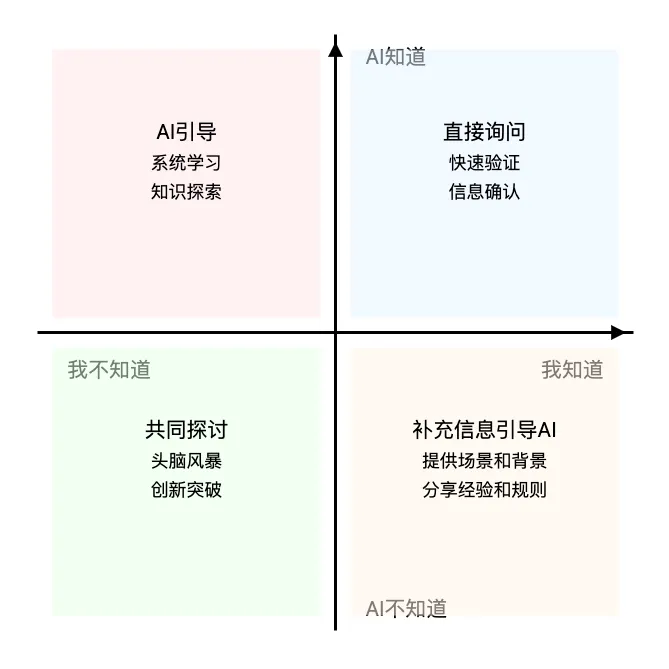

观察一个有意思的现象：当大家都在惊叹 AI 能写文案、画图、做 PPT 时,我发现真正玩得溜的人,往往不是技术大牛,而是那些思考深度比较强的人。给我印象最深的是李继刚基于自己的深度思考让我看到了 AI 的无限可能性。

为什么会这样?

<u>因为 AI 带来的是信息的平权,而不是思考的平权。这个时代,知识获取的门槛前所未有的低,但思考能力反而变得更加稀缺和珍贵。</u>

举个例子：现在你问 AI"怎么做好产品运营",它能立刻给你一大堆专业建议。

但真正区分度在于 你知道该问什么问题吗?你能判断这些建议是否适合你的场景吗?你能从这些建议中提炼出真正有价值的洞见吗?

这就是认知的差距。

在 AI 时代,知识获取已经从过去的"被动接受"变成了"主动探寻"。比起死记硬背的知识储备,更重要的是:
● 你会提什么问题
● 你如何判断信息的价值
● 你能否找到事物的本质

基础性的知识储备重要性正在降低,但获取知识的能力却变得前所未有的重要。这意味着我们需要重新思考如何与 AI 对话和协作。

在实践中,与 AI 的对话可以分为四种典型场景:

我知道,AI 知道

这类知识像是基本概念、通用原理这样的基础内容。在这种情况下,AI 可以作为我们的复核工具,帮助快速验证想法,节省查证时间。比如确认一个专业术语的具体定义,或验证某个观点是否准确。

我知道,AI 不知道

这是属于个人独特经验和行业深度认知的部分。比如你在某个行业深耕多年的实战经验,或是对某个细分市场的独到见解。这时候,我们要做的是用 AI 作为工具,帮助我们更好地表达和扩展这些独特认知。

我不知道,AI 知道

这种场景需要我们主动引导 AI。关键在于如何把我们的专业知识和经验清晰地传达给 AI。只有当 AI 充分理解了你的专业背景,它才能真正成为帮你实现想法的得力助手。这个过程不仅是在引导 AI,也是在梳理和提炼自己的经验认知。

首先,要提供足够的上下文和背景信息。说明具体的应用场景和限制条件，解释行业特有的规则和惯例，描述问题的独特性和关键考虑因素。

其次,要建立必要的知识框架:定义专业术语和概念，说明因果关系和逻辑链条，分享实践中的经验教训和注意事项。

这是拓展认知的黄金场景。AI 可以作为我们的知识助手,帮助我们快速了解新领域、新概念。但要注意,这里的关键不是简单地获取信息,而是要学会提出正确的问题,并对 AI 给出的答案进行思考和消化。

我不知道,AI 不知道

这是最具创新性的场景,也是人类认知的边界。这种场景可以与 AI 共同探讨。面对未知领域时,把 AI 当作头脑风暴的伙伴,通过不断的对话和交流,探索新的可能性。

对于那些热爱思考、喜欢探索事物本质的人来说,AI 时代带来了前所未有的机遇。因为只要你能洞察规律,就能借助 AI 构建无限可能。只要你有独特的想法,就能跳过繁琐步骤,直达目标。

所以,与其焦虑 AI 会取代人类,不如把精力放在提升自己的认知边界上。因为在这个时代,你对自己、对世界、对领域的认知深度,才是决定你能把 AI 用到什么程度的关键。

AI 永远只是工具,真正的主导权在于使用工具的人。而要真正驾驭这个工具,关键不在于技术,而在于思考的深度和广度。
