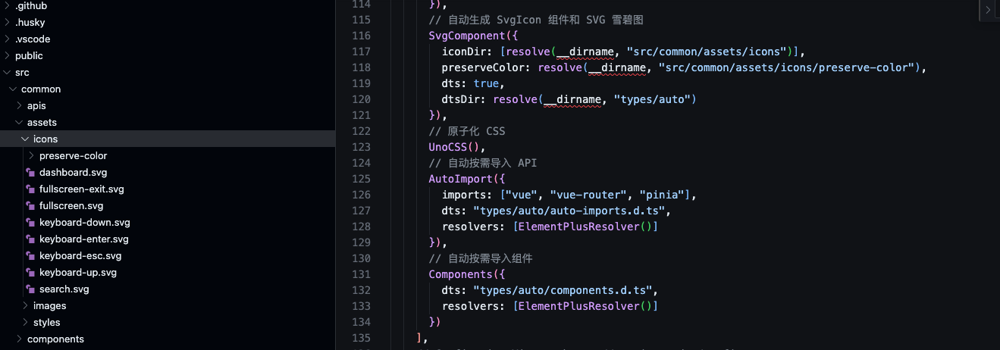

# 时间插件

| 插件名称   | 插件地址                                         | Demo                                              | 插件描述                                               |
| ---------- | ------------------------------------------------ | ------------------------------------------------- | ------------------------------------------------------ |
| Day.js     | [查看](https://github.com/iamkun/dayjs)          | [预览](https://dayjs.fenxianglu.cn/)              | 日期时间处理组件                                       |
| moment     | [查看](https://www.npmjs.com/package/moment)     | [预览](https://momentjs.com/)                     | 在 JavaScript 中解析、验证、操作和显示日期和时间       |
| date-fns   | [查看](https://www.npmjs.com/package/date-fns)   | [预览](https://date-fns.org/docs/Getting-Started) | date-fns 用于在浏览器和 Node.js 中操作 JavaScript 日期 |
| timeago.js | [查看](https://www.npmjs.com/package/timeago.js) | -                                                 | 专注于显示相对时间（例如“5 分钟前”或者“3 天后”）       |

# 视频插件

| 插件名称    | 插件地址                                                               | Demo                                                              | 插件描述                                                  |
| ----------- | ---------------------------------------------------------------------- | ----------------------------------------------------------------- | --------------------------------------------------------- |
| video.js    | [查看](https://www.npmjs.com/package/video.js)                         | [预览](https://videojs.com/)                                      | 视频播放器                                                |
| plyr        | [查看](https://github.com/sampotts/plyr)                               | [预览](https://plyr.io/)                                          | 一个简单、易用且可定制的媒体播放器                        |
| artplayer   | [查看](https://artplayer.org/document/)                                | [预览](https://artplayer.org)                                     | 一款现代且功能齐全的 HTML5 视频播放器                     |
| hls.js      | [查看](https://github.com/video-dev/hls.js)                            | [预览](https://hlsjs.video-dev.org/demo/)                         | 一个专注于 HLS（HTTP Live Streaming）播放的 JavaScript 库 |
| xgplayer    | [查看](https://h5player.bytedance.com/)                                | [预览](https://h5player.bytedance.com/examples/)                  | 一款带解析器、能节省流量的 HTML5 视频播放器               |
| ckplayer x3 | [查看](https://www.ckplayer.com/)                                      | [预览](https://www.ckplayer.com/demo.html)                        | 用于在网页上播放视频的 JS 插件                            |
| aliplayer   | [查看](https://help.aliyun.com/zh/vod/developer-reference/integration) | [预览](https://video.aliyuncs.com/player/presentation/index.html) | 阿里云 Web 播放器 SDK                                     |

# 条形码插件

| 插件名称  | 插件地址                                      | Demo                                         | 插件描述                                                 |
| --------- | --------------------------------------------- | -------------------------------------------- | -------------------------------------------------------- |
| JsBarcode | [查看](https://github.com/lindell/JsBarcode/) | [预览](https://lindell.me/JsBarcode/)        | 一个纯 JavaScript 实现的条形码生成器，支持多种条形码格式 |
| quagga    | [查看](https://www.npmjs.com/package/quagga)  | [预览](https://serratus.github.io/quaggaJS/) | 一个开源的条形码和二维码扫描库，支持 HTML5 和现代浏览器  |

# 图片插件

| 插件名称          | 插件地址                                                | Demo                                        | 插件描述     |
| ----------------- | ------------------------------------------------------- | ------------------------------------------- | ------------ |
| merge-images      | [查看](https://github.com/lukechilds/merge-images)      | -                                           | 图像合成插件 |
| v-viewer          | [查看](https://github.com/mirari/v-viewer)              | [预览](https://mirari.cc/posts/vue3-viewer) | 图片浏览组件 |
| hevue-img-preview | [查看](https://www.npmjs.com/package/hevue-img-preview) | [预览](https://heyongsheng.github.io/)      | 图片浏览插件 |

# 适配插件

| 插件名称               | 插件地址                                                     | Demo                                                                 | 插件描述                                                                  |
| ---------------------- | ------------------------------------------------------------ | -------------------------------------------------------------------- | ------------------------------------------------------------------------- |
| postcss-mobile-forever | [查看](https://github.com/wswmsword/postcss-mobile-forever)  | [预览](https://wswmsword.github.io/examples/mobile-forever/vanilla/) | PostCSS 伸缩视图转换插件                                                  |
| postcss-px-to-viewport | [查看](https://www.npmjs.com/package/postcss-px-to-viewport) | -                                                                    | 将 px 单位转换为视口单位的(vw,vh,vmin,vmax)的 PostCSS 插件.               |
| Autoprefixer           | [查看](https://www.npmjs.com/package/autoprefixer)           | -                                                                    | 基于 [Can I Use](https://caniuse.com/) 的数据， 为 CSS 添加必要的厂商前缀 |
| postcss-pxtorem        | [查看](https://www.npmjs.com/package/postcss-pxtorem)        | -                                                                    | PostCSS 的一个插件，可以从像素单位生成 rem 单位                           |

# 打包插件

## [@vitejs/plugin-vue-jsx](https://www.npmjs.com/package/@vitejs/plugin-vue-jsx)

Provides Vue 3 JSX & TSX support with HMR.

```ts
// vite.config.js
import vueJsx from '@vitejs/plugin-vue-jsx';

export default defineConfig(() => {
  return {
    plugins: [
      vueJsx({
        // options are passed on to @vue/babel-plugin-jsx
      }),
    ],
  };
});
```

## [unplugin-auto-import](https://www.npmjs.com/package/unplugin-auto-import)

为 Vite、Webpack、Rspack、Rollup 和 esbuild 自动按需导入 API，并支持 TypeScript。由 unplugin 提供支持。

### without

```js
import { computed, ref } from 'vue';

const count = ref(0);
const doubled = computed(() => count.value * 2);
```

### with

```js
const count = ref(0);
const doubled = computed(() => count.value * 2);
```

### vite 配置

`pnpm i unplugin-vue-components unplugin-auto-import/vite -D`

```js
import AutoImport from 'unplugin-auto-import/vite';
import { AntDesignVueResolver } from 'unplugin-vue-components/resolvers';

export default defineConfig(() => {
  return {
    plugins: [
      AutoImport({
        include: [/\.[tj]sx?$/, /\.vue$/, /\.vue\?vue/],
        imports: ['vue', 'pinia', 'vue-router'],
        // 调整自动引入的文件位置
        dts: './auto-import.d.ts',
        // 解决自动引入eslint报错问题 需要在eslintrc的extend选项中引入
        eslintrc: {
          enabled: true,
          // 配置文件的位置
          filepath: './.eslintrc-auto-import.json',
          globalsPropValue: true,
        },
        // 自动导入element
        resolvers: [AntDesignVueResolver()],
      }),
    ],
  };
});
```

## [unplugin-vue-components](https://www.npmjs.com/package/unplugin-vue-components)

按需自动导入 Vue 组件。

```js
import {
  AntDesignVueResolver,
  ElementPlusResolver,
  VantResolver,
} from 'unplugin-vue-components/resolvers';
// vite.config.js
import Components from 'unplugin-vue-components/vite';

// your plugin installation
Components({
  resolvers: [AntDesignVueResolver(), ElementPlusResolver(), VantResolver()],
});
```

## [vite-plugin-compression](https://www.npmjs.com/package/vite-plugin-compression)

使用 gzip 或者 brotli 来压缩资源.

```js
import viteCompression from 'vite-plugin-compression';

export default () => {
  return {
    plugins: [viteCompression()],
  };
};
```

### 配置说明

| 参数               | 类型                                  | 默认值          | 说明                                                                 |
| ------------------ | ------------------------------------- | --------------- | -------------------------------------------------------------------- |
| verbose            | `boolean`                             | `true`          | 是否在控制台输出压缩结果                                             |
| filter             | `RegExp or (file: string) => boolean` | `DefaultFilter` | 指定哪些资源不压缩                                                   |
| disable            | `boolean`                             | `false`         | 是否禁用                                                             |
| threshold          | `number`                              | -               | 体积大于 threshold 才会被压缩,单位 b                                 |
| algorithm          | `string`                              | `gzip`          | 压缩算法,可选 [ 'gzip' , 'brotliCompress' ,'deflate' , 'deflateRaw'] |
| ext                | `string`                              | `.gz`           | 生成的压缩包后缀                                                     |
| compressionOptions | `object`                              | -               | 对应的压缩算法的参数                                                 |
| deleteOriginFile   | `boolean`                             | -               | 压缩后是否删除源文件                                                 |

### 示例

```js
commpressPlugin({
  verbose: true, // 默认即可
  disable: false, // 开启压缩(不禁用)，默认即可
  deleteOriginFile: false, // 删除源文件
  threshold: 1024, // 压缩前最小文件大小
  algorithm: 'gzip', // 压缩算法
  ext: '.gz', // 文件类型
});
```

## [splitVendorChunkPlugin](https://github.dev/vitejs/vite)

splitVendorChunk 是 Vite 提供的一种模块分割策略，用于将第三方依赖（如 node_modules 中的模块）提取到单独的 vendor chunk 中

```js
import { defineConfig, splitVendorChunkPlugin } from 'vite';

export default defineConfig({
  plugins: [
    splitVendorChunkPlugin(), // 添加插件
  ],
});
```

## [loadEnv](https://github.dev/vitejs/vite)

使用 dotenv 解析 .env 文件内容

```js
import { defineConfig, loadEnv } from 'vite';
import path from 'path';

export default defineConfig(({ mode }) => {
  // 加载环境变量
  const env = loadEnv(mode, path.resolve(__dirname, './env'));

  return {
    define: {
      // 将环境变量注入到客户端
      'process.env': env,
    },
  };
});
```

## [vite-plugin-lazy-import](https://www.npmjs.com/package/vite-plugin-lazy-import)

用于 Vite 的按需懒加载导入 JavaScript 和样式文件。

```js
// vite.config.js
import { lazyImport } from 'vite-plugin-lazy-import';

export default defineConfig({
  // ...
  plugins: [
    lazyImport({
      resolvers: [
        VxeResolver({
          libraryName: 'vxe-table',
        }),
        VxeResolver({
          libraryName: 'vxe-pc-ui',
        }),
      ],
    }),
  ],
  // ...
});
```

## [@vitejs/plugin-basic-ssl](https://www.npmjs.com/package/@vitejs/plugin-basic-ssl)

本地运行支持 https

```js
// vite.config.js
import basicSsl from '@vitejs/plugin-basic-ssl';

export default {
  plugins: [basicSsl()],
};
```

## [unocss/vite](https://www.npmjs.com/package/@unocss/vite)

原子化 css

```js
import UnoCSS from 'unocss/vite';
import { defineConfig } from 'vite';

export default defineConfig({
  plugins: [UnoCSS()],
});
```

### Create a `uno.config.ts` file:

```ts
import { defineConfig, presetAttributify, presetWind3 } from 'unocss';

export default defineConfig({
  // 预设
  presets: [
    // 属性化模式 & 无值的属性模式
    presetAttributify({
      prefix: 'un-',
      prefixedOnly: false,
    }),
    // 默认预设
    presetWind3({
      important: '#app',
    }),
  ],
  // 自定义规则
  rules: [],
  // 自定义快捷方式
  shortcuts: {
    'wh-full': 'w-full h-full',
    'flex-center': 'flex justify-center items-center',
    'flex-x-center': 'flex justify-center',
    'flex-y-center': 'flex items-center',
  },
});
```

### Add `virtual:uno.css` to your main entry

```ts
import 'virtual:uno.css';
```

## [unplugin-svg-component](https://www.npmjs.com/package/unplugin-svg-component)

```js
// vite.config.ts
import { defineConfig } from 'vite';
import SvgComponent from 'unplugin-svg-component/vite';

export default defineConfig({
  plugins: [
    SvgComponent({
      iconDir: [resolve(__dirname, 'src/common/assets/icons')],
      preserveColor: resolve(__dirname, 'src/common/assets/icons/preserve-color'),
      dts: true,
      dtsDir: resolve(__dirname, 'types/auto'),
    }),
  ],
});
```



### types/auto

`svg-component.d.ts`

```ts
/* eslint-disable */
/* prettier-ignore */
// biome-ignore format: off
// biome-ignore lint: off
// @ts-nocheck
// Generated by unplugin-svg-component
declare module '~virtual/svg-component' {
  const SvgIcon: import("vue").DefineComponent<{
      name: {
          type: import("vue").PropType<"dashboard" | "fullscreen-exit" | "fullscreen" | "keyboard-down" | "keyboard-enter" | "keyboard-esc" | "keyboard-up" | "search">;
          default: string;
          required: true;
      };
  }, {}, unknown, {}, {}, import("vue").ComponentOptionsMixin, import("vue").ComponentOptionsMixin, {}, string, import("vue").VNodeProps & import("vue").AllowedComponentProps & import("vue").ComponentCustomProps, Readonly<import("vue").ExtractPropTypes<{
      name: {
          type: import("vue").PropType<"dashboard" | "fullscreen-exit" | "fullscreen" | "keyboard-down" | "keyboard-enter" | "keyboard-esc" | "keyboard-up" | "search">;
          default: string;
          required: true;
      };
  }>>, {
      name: "dashboard" | "fullscreen-exit" | "fullscreen" | "keyboard-down" | "keyboard-enter" | "keyboard-esc" | "keyboard-up" | "search";
  }>;
  export const svgNames: ["dashboard", "fullscreen-exit", "fullscreen", "keyboard-down", "keyboard-enter", "keyboard-esc", "keyboard-up", "search"];
  export type SvgName = "dashboard" | "fullscreen-exit" | "fullscreen" | "keyboard-down" | "keyboard-enter" | "keyboard-esc" | "keyboard-up" | "search";
  export default SvgIcon;
}
```

`svg-component-global.d.ts`

```ts
/* eslint-disable */
/* prettier-ignore */
// biome-ignore format: off
// biome-ignore lint: off
// @ts-nocheck
// Generated by unplugin-svg-component
import 'vue'
declare module 'vue' {
  export interface GlobalComponents {
    SvgIcon: import('vue').DefineComponent<
      {
        name: {
          type: import('vue').PropType<
            | 'dashboard'
            | 'fullscreen-exit'
            | 'fullscreen'
            | 'keyboard-down'
            | 'keyboard-enter'
            | 'keyboard-esc'
            | 'keyboard-up'
            | 'search'
          >;
          default: string;
          required: true;
        };
      },
      {},
      unknown,
      {},
      {},
      import('vue').ComponentOptionsMixin,
      import('vue').ComponentOptionsMixin,
      {},
      string,
      import('vue').VNodeProps &
        import('vue').AllowedComponentProps &
        import('vue').ComponentCustomProps,
      Readonly<
        import('vue').ExtractPropTypes<{
          name: {
            type: import('vue').PropType<
              | 'dashboard'
              | 'fullscreen-exit'
              | 'fullscreen'
              | 'keyboard-down'
              | 'keyboard-enter'
              | 'keyboard-esc'
              | 'keyboard-up'
              | 'search'
            >;
            default: string;
            required: true;
          };
        }>
      >,
      {
        name:
          | 'dashboard'
          | 'fullscreen-exit'
          | 'fullscreen'
          | 'keyboard-down'
          | 'keyboard-enter'
          | 'keyboard-esc'
          | 'keyboard-up'
          | 'search';
      }
    >;
  }
}
```

### main.ts

```ts
// main.ts
import SvgIcon from '~virtual/svg-component';

app.component(SvgIcon.name, SvgIcon);
```

### 使用

```ts
// App.tsx
import SvgIcon from '~virtual/svg-component';

function App() {
  return (
    <div className="logo">
      <SvgIcon name="icon-react"></SvgIcon>
    </div>
  );
}
```

# git 评论插件

| 插件名称   | 插件地址                          | Demo                                         | 插件描述                                                   |
| ---------- | --------------------------------- | -------------------------------------------- | ---------------------------------------------------------- |
| giscus     | [查看](https://giscus.app/zh-CN)  | [预览](https://giscus-component.vercel.app/) | 利用 GitHub Discussions 实现的评论系统                     |
| utterances | [查看](https://utteranc.es/)      | -                                            | A lightweight comments widget built on GitHub issues       |
| Beaudar    | [查看](https://beaudar.lipk.org/) | -                                            | Beaudar 名称源于粤语“表达”的发音，是 Utterances 的中文版本 |

# 其他插件

| 插件名称                      | 插件地址                                                       | Demo                                 | 插件描述                                 |
| ----------------------------- | -------------------------------------------------------------- | ------------------------------------ | ---------------------------------------- |
| auto-i18n-translation-plugins | [查看](https://github.com/wenps/auto-i18n-translation-plugins) | -                                    | 前端自动翻译插件，集成有道翻译和谷歌翻译 |
| enlarge-file-upload           | [查看](https://www.npmjs.com/package/enlarge-file-upload)      | [预览](http://jiang-12-13.com:8988/) | 大文件切片上传                           |
