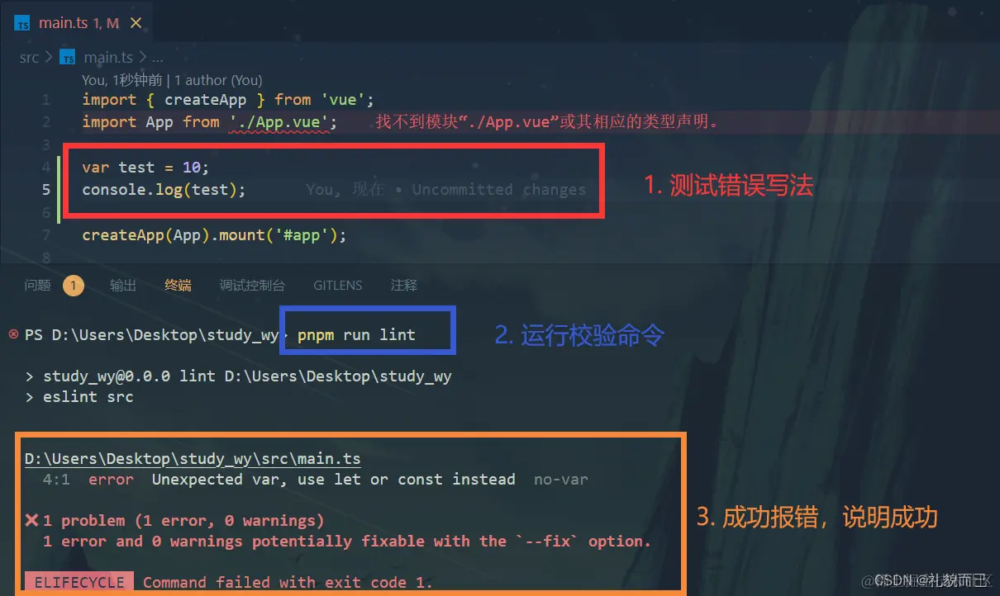
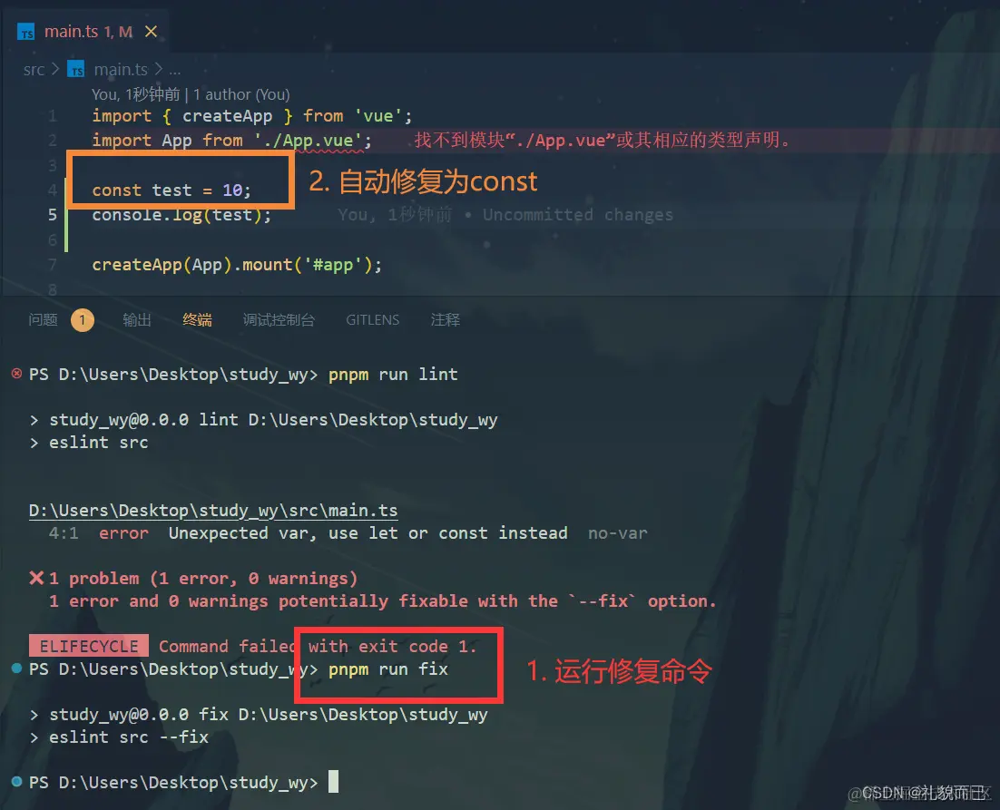

## 安装 eslint

```bash
pnpm i eslint -D
```

## 生成 eslint 配置文件

```bash
pnpm eslint --init
```

运行命令后会在根目录生成一个`.eslintrc.cjs`文件，其中的代码如下：

```bash
module.exports = {
    "env": {
        "browser": true,
        "es2021": true
    },
    "extends": [
        "eslint:recommended",
        "plugin:@typescript-eslint/recommended",
        "plugin:vue/vue3-essential",
        'plugin:prettier/recommended',
    ],
    "overrides": [
        {
            "env": {
                "node": true
            },
            "files": [
                ".eslintrc.{js,cjs}"
            ],
            "parserOptions": {
                "sourceType": "script"
            }
        }
    ],
    "parserOptions": {
        "ecmaVersion": "latest",
        "parser": "@typescript-eslint/parser",
        "sourceType": "module"
    },
    "plugins": [
        "@typescript-eslint",
        "vue"
    ],
  "rules": {}
}
```

## 完善 .eslintrc.cjs 文件中的 rules 对象

```bash
  rules: {
    // eslint（https://eslint.bootcss.com/docs/rules/）
    'no-var': 'error', // 要求使用 let 或 const 而不是 var
    'no-multiple-empty-lines': ['warn', { max: 1 }], // 不允许多个空行
    'no-console': process.env.NODE_ENV === 'production' ? 'error' : 'off',
    'no-debugger': process.env.NODE_ENV === 'production' ? 'error' : 'off',
    'no-unexpected-multiline': 'error', // 禁止空余的多行
    'no-useless-escape': 'off', // 禁止不必要的转义字符

    // typeScript (https://typescript-eslint.io/rules)
    '@typescript-eslint/no-unused-vars': 'error', // 禁止定义未使用的变量
    '@typescript-eslint/prefer-ts-expect-error': 'error', // 禁止使用 @ts-ignore
    '@typescript-eslint/no-explicit-any': 'off', // 禁止使用 any 类型
    '@typescript-eslint/no-non-null-assertion': 'off',
    '@typescript-eslint/no-namespace': 'off', // 禁止使用自定义 TypeScript 模块和命名空间。
    '@typescript-eslint/semi': 'off',

    // eslint-plugin-vue (https://eslint.vuejs.org/rules/)
    'vue/multi-word-component-names': 'off', // 要求组件名称始终为 “-” 链接的单词
    'vue/script-setup-uses-vars': 'error', // 防止<script setup>使用的变量<template>被标记为未使用
    'vue/no-mutating-props': 'off', // 不允许组件 prop的改变
    'vue/attribute-hyphenation': 'off' // 对模板中的自定义组件强制执行属性命名样式
  }

```

## 新建忽略文件

在项目根目录新建 `.eslintignore` 文件，并写入如下代码：

```bash
/node_modules/
/public/
/dist/
postcss.config.js
.vscode
.idea
auto-import.d.ts
```

## 添加脚本

在 `packjson.json` 中 `script` 字段中添加俩行命令

```bash
"lint": "eslint src",
"fix": "eslint src --fix"
```

## 检测是否生效

在 `main.ts` 中使用 `var` 数据类型，终端运行 `pnpm run lint` 命令，出现如下错误说明 `eslint` 安装并配置成功



接着试运行修复命令 `pnpm run fix`，修复成功，证明配置成功


