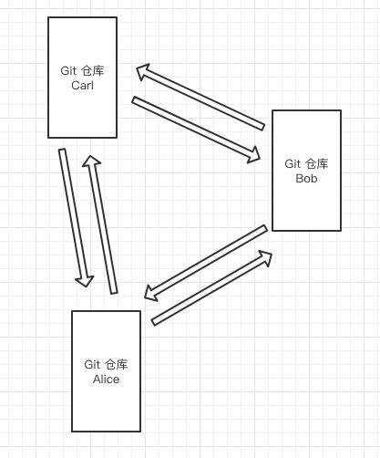

# HTML、CSS 标准规范

遵循 [W3C 的 HTML 标准](https://html.spec.whatwg.org/multipage/),使用语义化标签，如 `<header>`、`<article>`、`<section>` 等,确保 HTML 的结构清晰，嵌套关系正确。

# Google HTML/CSS Style Guide

- [Google HTML/CSS Style Guide](https://google.github.io/styleguide/htmlcssguide.html) 是一个简洁明确的规范，涵盖了 HTML 和 CSS 的常见写法。
- 强调代码的可读性和一致性，例如：
  - HTML 属性按照特定顺序排列（id、class、src 等）。
  - 缩进使用 2 个空格，不使用 Tab。
  - 避免使用内联样式。

# Airbnb CSS / Sass Styleguide

- [Airbnb Style Guide](https://github.com/airbnb/css?tab=readme-ov-file) 主要针对 CSS 的规则。
- 特点：
  - 强调语义化标签和无障碍设计。
  - 使用双引号包裹 HTML 属性值（如 class="example"）。
  - 尽量减少不必要的标签嵌套。

# HTML 编码规范

## 1 前言

本文档的目标是使 HTML 代码风格保持一致，容易被理解和被维护,具体内容可根据实际情况调整

## 2 代码风格

### 2.1 缩进与换行

#### [强制] 使用 `2` 个空格做为一个缩进层级，不允许使用 `4` 个空格 或 `tab` 字符。

示例：

```html
<ul>
  <li>first</li>
  <li>second</li>
</ul>
```

#### [建议] 每行不得超过 `120` 个字符。

解释：

过长的代码不容易阅读与维护。但是考虑到 HTML 的特殊性，不做硬性要求。

### 2.2 命名

#### [强制] `class` 必须单词全字母小写，单词间以 `-` 分隔。

#### [强制] `class` 必须代表相应模块或部件的内容或功能，不得以样式信息进行命名。

示例：

```html
<!-- good -->
<div class="sidebar"></div>

<!-- bad -->
<div class="left"></div>
```

#### [强制] 元素 `id` 必须保证页面唯一。

解释：

同一个页面中，不同的元素包含相同的 `id`，不符合 `id` 的属性含义。并且使用 `document.getElementById` 时可能导致难以追查的问题。

#### [强制] `id` 单词使用小驼峰命名。

#### [建议] `id`、`class` 命名，在避免冲突并描述清楚的前提下尽可能短。

示例：

```html
<!-- good -->
<div id="nav"></div>
<!-- bad -->
<div id="navigation"></div>

<!-- good -->
<p class="comment"></p>
<!-- bad -->
<p class="com"></p>

<!-- good -->
<span class="author"></span>
<!-- bad -->
<span class="red"></span>
```

#### [强制] 禁止为了 `hook 脚本`，创建无样式信息的 `class`。

解释：

不允许 `class` 只用于让 JavaScript 选择某些元素，`class` 应该具有明确的语义和样式。否则容易导致 CSS class 泛滥。

使用 `id`、属性选择作为 hook 是更好的方式。

#### [强制] 同一页面，应避免使用相同的 `name` 与 `id`。

解释：

IE 浏览器会混淆元素的 `id` 和 `name` 属性， `document.getElementById` 可能获得不期望的元素。所以在对元素的 `id` 与 `name` 属性的命名需要非常小心。

一个比较好的实践是，为 `id` 和 `name` 使用不同的命名法。

示例：

```html
<input name="foo" />
<div id="foo"></div>
<script>
  // IE6 将显示 INPUT
  alert(document.getElementById('foo').tagName);
</script>
```

### 2.3 标签

#### [强制] 标签名必须使用小写字母。

示例：

```html
<!-- good -->
<p>Hello StyleGuide!</p>

<!-- bad -->
<p>Hello StyleGuide!</p>
```

#### [强制] 对于无需自闭合的标签，不允许自闭合。

解释：

常见无需自闭合标签有 `input`、`br`、`img`、`hr` 等。

示例：

```html
<!-- good -->
<input type="text" name="title" />

<!-- bad -->
<input type="text" name="title" />
```

#### [强制] 对 `HTML5` 中规定允许省略的闭合标签，不允许省略闭合标签。

解释：

对代码体积要求非常严苛的场景，可以例外。比如：第三方页面使用的投放系统。

示例：

```html
<!-- good -->
<ul>
  <li>first</li>
  <li>second</li>
</ul>

<!-- bad -->
<ul>
  <li>first</li>
  <li>second</li>
</ul>
```

#### [强制] 标签使用必须符合标签嵌套规则。

解释：

比如 `div` 不得置于 `p` 中，`tbody` 必须置于 `table` 中。

#### [建议] HTML 标签的使用应该遵循标签的语义。

解释：

下面是常见标签语义

- p - 段落
- h1,h2,h3,h4,h5,h6 - 层级标题
- strong,em - 强调
- ins - 插入
- del - 删除
- abbr - 缩写
- code - 代码标识
- cite - 引述来源作品的标题
- q - 引用
- blockquote - 一段或长篇引用
- ul - 无序列表
- ol - 有序列表
- dl,dt,dd - 定义列表

示例：

```html
<!-- good -->
<p>
  Esprima serves as an important <strong>building block</strong> for some JavaScript language tools.
</p>

<!-- bad -->
<div>
  Esprima serves as an important <span class="strong">building block</span> for some JavaScript
  language tools.
</div>
```

#### [强制] 在 CSS 可以实现相同需求的情况下不得使用表格进行布局。

解释：

在兼容性允许的情况下应尽量保持语义正确性。对网格对齐和拉伸性有严格要求的场景允许例外，如多列复杂表单。

#### [建议] 标签的使用应尽量简洁，减少不必要的标签。

示例：

```html
<!-- good -->


<!-- bad -->
<span class="avatar">
  
</span>
```

### 2.4 属性

#### [强制] 属性名必须使用小写字母。

示例：

```html
<!-- good -->
<table cellspacing="0">
  ...
</table>

<!-- bad -->
<table cellspacing="0">
  ...
</table>
```

#### [强制] 属性值必须用双引号包围。

解释：

不允许使用单引号，不允许不使用引号。

示例：

```html
<!-- good -->
<script src="esl.js"></script>

<!-- bad -->
<script src="esl.js"></script>
<script src="esl.js"></script>
```

#### [建议] 布尔类型的属性，建议不添加属性值。

示例：

```html
<input type="text" disabled /> <input type="checkbox" value="1" checked />
```

#### [建议] 自定义属性建议以 `xxx-` 为前缀，推荐使用 `data-`。

解释：

使用前缀有助于区分自定义属性和标准定义的属性。

示例：

```html
<ol data-ui-type="Select"></ol>
```

## 3 通用

### 3.1 DOCTYPE

#### [强制] 使用 `HTML5` 的 `doctype` 来启用标准模式，建议使用大写的 `DOCTYPE`。

示例：

```html
<!DOCTYPE html>
```

#### [强制] 启用 IE Edge 模式。

示例：

```html
<meta http-equiv="X-UA-Compatible" content="IE=Edge" />
```

#### [建议] 在 `html` 标签上设置正确的 `lang` 属性。

解释：

有助于提高页面的可访问性，如：让语音合成工具确定其所应该采用的发音，令翻译工具确定其翻译语言等。

示例：

```html
<html lang="zh-CN"></html>
```

### 3.2 编码

#### [强制] 页面必须使用精简形式，明确指定字符编码。指定字符编码的 `meta` 必须是 `head` 的第一个直接子元素。

示例：

```html
<html>
  <head>
    <meta charset="UTF-8" />
    ......
  </head>
  <body>
    ......
  </body>
</html>
```

#### [建议] `HTML` 文件使用无 `BOM` 的 `UTF-8` 编码。

解释：

`UTF-8` 编码具有更广泛的适应性。`BOM` 在使用程序或工具处理文件时可能造成不必要的干扰。

### 3.3 CSS 和 JavaScript 引入

#### [强制] 引入 `CSS` 时必须指明 `rel="stylesheet"`。

示例：

```html
<link rel="stylesheet" href="page.css" />
```

#### [建议] 引入 `CSS` 和 `JavaScript` 时无须指明 `type` 属性。

解释：

`text/css` 和 `text/javascript` 是 `type` 的默认值。

#### [建议] 展现定义放置于外部 `CSS` 中，行为定义放置于外部 `JavaScript` 中。

解释：

结构-样式-行为的代码分离，对于提高代码的可阅读性和维护性都有好处。

#### [建议] 在 `head` 中引入页面需要的所有 `CSS` 资源。

解释：

在页面渲染的过程中，新的 CSS 可能导致元素的样式重新计算和绘制，页面闪烁。

#### [建议] `JavaScript` 应当放在页面末尾，或采用异步加载。

解释：

将 `script` 放在页面中间将阻断页面的渲染。出于性能方面的考虑，如非必要，请遵守此条建议。

示例：

```html
<body>
  <!-- a lot of elements -->
  <script src="init-behavior.js"></script>
</body>
```

#### [建议] 移动环境或只针对现代浏览器设计的 Web 应用，如果引用外部资源的 `URL` 协议部分与页面相同，建议省略协议前缀。

示例：

```html
<script src="//s1.bdstatic.com/cache/static/jquery-1.10.2.min_f2fb5194.js"></script>
```

## 4 head

### 4.1 title

#### [强制] 页面必须包含 `title` 标签声明标题。

#### [强制] `title` 必须作为 `head` 的直接子元素，并紧随 `charset` 声明之后。

解释：

`title` 中如果包含 ASCII 之外的字符，浏览器需要知道字符编码类型才能进行解码，否则可能导致乱码。

示例：

```html
<head>
  <meta charset="UTF-8" />
  <title>页面标题</title>
</head>
```

### 4.2 favicon

#### [强制] 保证 `favicon` 可访问。

解释：

在未指定 favicon 时，大多数浏览器会请求 Web Server 根目录下的 `favicon.ico` 。为了保证 favicon 可访问，避免 404，必须遵循以下两种方法之一：

1. 在 Web Server 根目录放置 `favicon.ico` 文件。
2. 使用 `link` 指定 favicon。

示例：

```html
<link rel="shortcut icon" href="path/to/favicon.ico" />
```

### 4.3 viewport

#### [建议] 若页面欲对移动设备友好，需指定页面的 `viewport`。

解释：

viewport meta tag 可以设置可视区域的宽度和初始缩放大小，避免在移动设备上出现页面展示不正常。

比如，在页面宽度小于 `980px` 时，若需 iOS 设备友好，应当设置 viewport 的 `width` 值来适应你的页面宽度。同时因为不同移动设备分辨率不同，在设置时，应当使用 `device-width` 和 `device-height` 变量。

## 5 图片

#### [强制] 禁止 `img` 的 `src` 取值为空。延迟加载的图片也要增加默认的 `src`。

解释：

`src` 取值为空，会导致部分浏览器重新加载一次当前页面

#### [建议] 避免为 `img` 添加不必要的 `title` 属性。

解释：

多余的 `title` 影响看图体验，并且增加了页面尺寸。

#### [建议] 为重要图片添加 `alt` 属性。

解释：

可以提高图片加载失败时的用户体验。

#### [建议] 添加 `width` 和 `height` 属性，以避免页面抖动。

#### [建议] 有下载需求的图片采用 `img` 标签实现，无下载需求的图片采用 CSS 背景图实现。

解释：

1. 产品 logo、用户头像、用户产生的图片等有潜在下载需求的图片，以 `img` 形式实现，能方便用户下载。
2. 无下载需求的图片，比如：icon、背景、代码使用的图片等，尽可能采用 CSS 背景图实现。

## 6 表单

### 6.1 控件标题

#### [强制] 有文本标题的控件必须使用 `label` 标签将其与其标题相关联。

解释：

有两种方式：

1. 将控件置于 `label` 内。
2. `label` 的 `for` 属性指向控件的 `id`。

推荐使用第一种，减少不必要的 `id`。如果 DOM 结构不允许直接嵌套，则应使用第二种。

示例：

```html
<label><input type="checkbox" name="confirm" value="on" /> 我已确认上述条款</label>

<label for="username">用户名：</label> <input type="textbox" name="username" id="username" />
```

### 6.2 按钮

#### [强制] 使用 `button` 元素时必须指明 `type` 属性值。

解释：

`button` 元素的默认 `type` 为 `submit`，如果被置于 `form` 元素中，点击后将导致表单提交。为显示区分其作用方便理解，必须给出 `type` 属性。

示例：

```html
<button type="submit">提交</button> <button type="button">取消</button>
```

#### [建议] 尽量不要使用按钮类元素的 `name` 属性。

解释：

由于浏览器兼容性问题，使用按钮的 `name` 属性会带来许多难以发现的问题。

### 6.3 可访问性

#### [建议] 负责主要功能的按钮在 DOM 中的顺序应靠前。

解释：

负责主要功能的按钮应相对靠前，以提高可访问性。如果在 CSS 中指定了 `float: right` 则可能导致视觉上主按钮在前，而 DOM 中主按钮靠后的情况。

示例：

```html
<!-- good -->
<style>
  .buttons .button-group {
    float: right;
  }
</style>

<div class="buttons">
  <div class="button-group">
    <button type="submit">提交</button>
    <button type="button">取消</button>
  </div>
</div>

<!-- bad -->
<style>
  .buttons button {
    float: right;
  }
</style>

<div class="buttons">
  <button type="button">取消</button>
  <button type="submit">提交</button>
</div>
```

#### [建议] 在针对移动设备开发的页面时，根据内容类型指定输入框的 `type` 属性。

解释：

根据内容类型指定输入框类型，能获得能友好的输入体验。

示例：

```html
<input type="date" />
```

## 7 多媒体

#### [建议] 当在现代浏览器中使用 `audio` 以及 `video` 标签来播放音频、视频时，应当注意格式。

解释：

音频应尽可能覆盖到如下格式：

- MP3
- WAV
- Ogg

视频应尽可能覆盖到如下格式：

- MP4
- WebM
- Ogg

#### [建议] 在支持 `HTML5` 的浏览器中优先使用 `audio` 和 `video` 标签来定义音视频元素。

#### [建议] 使用退化到插件的方式来对多浏览器进行支持。

示例：

```html
<audio controls>
  <source src="audio.mp3" type="audio/mpeg" />
  <source src="audio.ogg" type="audio/ogg" />
  <object width="100" height="50" data="audio.mp3">
    <embed width="100" height="50" src="audio.swf" />
  </object>
</audio>

<video width="100" height="50" controls>
  <source src="video.mp4" type="video/mp4" />
  <source src="video.ogg" type="video/ogg" />
  <object width="100" height="50" data="video.mp4">
    <embed width="100" height="50" src="video.swf" />
  </object>
</video>
```

#### [建议] 只在必要的时候开启音视频的自动播放。

#### [建议] 在 `object` 标签内部提供指示浏览器不支持该标签的说明。

示例：

```html
<object width="100" height="50" data="something.swf">DO NOT SUPPORT THIS TAG</object>
```

## 8 模板中的 HTML

#### [建议] 模板代码的缩进优先保证 HTML 代码的缩进规则。

示例：

```html
<!-- good -->
{if $display == true}
<div>
  <ul>
    {foreach $item_list as $item}
    <li>{$item.name}</li>
    <li>{/foreach}</li>
  </ul>
</div>
{/if}

<!-- bad -->
{if $display == true}
<div>
  <ul>
    {foreach $item_list as $item}
    <li>{$item.name}</li>
    <li>{/foreach}</li>
  </ul>
</div>
{/if}
```

#### [强制] 模板代码应以保证 HTML 单个标签语法的正确性为基本原则。

示例：

```html
<!-- good -->
<li class="{if $item.type_id == $current_type}focus{/if}">{ $item.type_name }</li>

<!-- bad -->
<li {if $item.type_id == $current_type} class="focus"{/if}>{ $item.type_name }</li>
```

# CSS 代码规范

## 1 前言

本文档的目标是使 CSS 代码风格保持一致，容易被理解和被维护。

虽然本文档是针对 CSS 设计的，但是在使用各种 CSS 的预编译器(如 less、sass、stylus 等)时，适用的部分也应尽量遵循本文档的约定。

## 2 代码风格

### 2.1 文件

#### [建议] `CSS` 文件使用无 `BOM` 的 `UTF-8` 编码。

解释：

UTF-8 编码具有更广泛的适应性。BOM 在使用程序或工具处理文件时可能造成不必要的干扰。

### 2.2 缩进

#### [强制] 使用 `4` 个空格做为一个缩进层级，不允许使用 `2` 个空格 或 `tab` 字符。

示例：

```css
.selector {
  margin: 0;
  padding: 0;
}
```

### 2.3 空格

#### [强制] `选择器` 与 `{` 之间必须包含空格。

示例：

```css
.selector {
}
```

#### [强制] `属性名` 与之后的 `:` 之间不允许包含空格， `:` 与 `属性值` 之间必须包含空格。

示例：

```css
margin: 0;
```

#### [强制] `列表型属性值` 书写在单行时，`,` 后必须跟一个空格。

示例：

```css
font-family: Arial, sans-serif;
```

#### [建议] 对于超长的样式，在样式值的 `空格` 处或 `,` 后换行，建议按逻辑分组。

示例：

```css
/* 不同属性值按逻辑分组 */
background: transparent url(aVeryVeryVeryLongUrlIsPlacedHere) no-repeat 0 0;

/* 可重复多次的属性，每次重复一行 */
background-image: url(aVeryVeryVeryLongUrlIsPlacedHere) url(anotherVeryVeryVeryLongUrlIsPlacedHere);

/* 类似函数的属性值可以根据函数调用的缩进进行 */
background-image: -webkit-gradient(
  linear,
  left bottom,
  left top,
  color-stop(0.04, rgb(88, 94, 124)),
  color-stop(0.52, rgb(115, 123, 162))
);
```

### 2.5 选择器

#### [强制] 当一个 rule 包含多个 selector 时，每个选择器声明必须独占一行。

示例：

```css
/* good */
.post,
.page,
.comment {
  line-height: 1.5;
}

/* bad */
.post,
.page,
.comment {
  line-height: 1.5;
}
```

#### [强制] `>`、`+`、`~` 选择器的两边各保留一个空格。

示例：

```css
/* good */
main > nav {
  padding: 10px;
}

label + input {
  margin-left: 5px;
}

input:checked ~ button {
  background-color: #69c;
}

/* bad */
main > nav {
  padding: 10px;
}

label + input {
  margin-left: 5px;
}

input:checked ~ button {
  background-color: #69c;
}
```

#### [强制] 属性选择器中的值必须用双引号包围。

解释：

不允许使用单引号，不允许不使用引号。

示例：

```css
/* good */
article[character='juliet'] {
  voice-family: 'Vivien Leigh', victoria, female;
}

/* bad */
article[character='juliet'] {
  voice-family: 'Vivien Leigh', victoria, female;
}
```

### 2.6 属性

#### [强制] 属性定义必须另起一行。

示例：

```css
/* good */
.selector {
  margin: 0;
  padding: 0;
}

/* bad */
.selector {
  margin: 0;
  padding: 0;
}
```

#### [强制] 属性定义后必须以分号结尾。

示例：

```css
/* good */
.selector {
  margin: 0;
}

/* bad */
.selector {
  margin: 0;
}
```

## 3 通用

### 3.1 选择器

#### [强制] 如无必要，不得为 `id`、`class` 选择器添加类型选择器进行限定。

解释：

在性能和维护性上，都有一定的影响。

示例：

```css
/* good */
#error,
.danger-message {
  font-color: #c00;
}

/* bad */
dialog#error,
p.danger-message {
  font-color: #c00;
}
```

#### [建议] 选择器的嵌套层级应不大于 `3` 级，位置靠后的限定条件应尽可能精确。

示例：

```css
/* good */
#username input {
}
.comment .avatar {
}

/* bad */
.page .header .login #username input {
}
.comment div * {
}
```

### 3.2 属性缩写

#### [建议] 在可以使用缩写的情况下，尽量使用属性缩写。

示例：

```css
/* good */
.post {
  font: 12px/1.5 arial, sans-serif;
}

/* bad */
.post {
  font-family: arial, sans-serif;
  font-size: 12px;
  line-height: 1.5;
}
```

#### [建议] 使用 `border` / `margin` / `padding` 等缩写时，应注意隐含值对实际数值的影响，确实需要设置多个方向的值时才使用缩写。

解释：

`border` / `margin` / `padding` 等缩写会同时设置多个属性的值，容易覆盖不需要覆盖的设定。如某些方向需要继承其他声明的值，则应该分开设置。

示例：

```css
article {
  margin: 5px;
  border: 1px solid #999;
}

/* good */
.page {
  margin-right: auto;
  margin-left: auto;
}

.featured {
  border-color: #69c;
}

/* bad */
.page {
  margin: 5px auto;
}

.featured {
  border: 1px solid #69c;
}
```

### 3.3 属性书写顺序

#### [建议] 同一 rule set 下的属性在书写时，应按功能进行分组，并以 **Formatting Model（布局方式、位置） > Box Model（尺寸） > Typographic（文本相关） > Visual（视觉效果）** 的顺序书写，以提高代码的可读性。

解释：

- Formatting Model 相关属性包括：`position` / `top` / `right` / `bottom` / `left` / `float` / `display` / `overflow` 等
- Box Model 相关属性包括：`border` / `margin` / `padding` / `width` / `height` 等
- Typographic 相关属性包括：`font` / `line-height` / `text-align` / `word-wrap` 等
- Visual 相关属性包括：`background` / `color` / `transition` / `list-style` 等

另外，如果包含 `content` 属性，应放在最前面。

示例：

```css
.sidebar {
  /* formatting model: positioning schemes / offsets / z-indexes / display / ...  */
  position: absolute;
  top: 50px;
  left: 0;
  overflow-x: hidden;

  /* box model: sizes / margins / paddings / borders / ...  */
  width: 200px;
  padding: 5px;
  border: 1px solid #ddd;

  /* typographic: font / aligns / text styles / ... */
  font-size: 14px;
  line-height: 20px;

  /* visual: colors / shadows / gradients / ... */
  background: #f5f5f5;
  color: #333;
  -webkit-transition: color 1s;
  -moz-transition: color 1s;
  transition: color 1s;
}
```

### 3.4 清除浮动

#### [建议] 当元素需要撑起高度以包含内部的浮动元素时，通过对伪类设置 `clear` 或触发 `BFC` 的方式进行 `clearfix`。尽量不使用增加空标签的方式。

解释：

触发 BFC 的方式很多，常见的有：

- float 非 none
- position 非 static
- overflow 非 visible

如希望使用更小副作用的清除浮动方法，参见 [A new micro clearfix hack](http://nicolasgallagher.com/micro-clearfix-hack/) 一文。

另需注意，对已经触发 BFC 的元素不需要再进行 clearfix。

### 3.5 !important

#### [建议] 尽量不使用 `!important` 声明。

#### [建议] 当需要强制指定样式且不允许任何场景覆盖时，通过标签内联和 `!important` 定义样式。

解释：

必须注意的是，仅在设计上 `确实不允许任何其它场景覆盖样式` 时，才使用内联的 `!important` 样式。通常在第三方环境的应用中使用这种方案。下面的 `z-index` 章节是其中一个特殊场景的典型样例。

### 3.6 z-index

#### [建议] 将 `z-index` 进行分层，对文档流外绝对定位元素的视觉层级关系进行管理。

解释：

同层的多个元素，如多个由用户输入触发的 Dialog，在该层级内使用相同的 `z-index` 或递增 `z-index`。

建议每层包含 100 个 `z-index` 来容纳足够的元素，如果每层元素较多，可以调整这个数值。

#### [建议] 在可控环境下，期望显示在最上层的元素，`z-index` 指定为 `999999`。

解释：

可控环境分成两种，一种是自身产品线环境；还有一种是可能会被其他产品线引用，但是不会被外部第三方的产品引用。

不建议取值为 `2147483647`。以便于自身产品线被其他产品线引用时，当遇到层级覆盖冲突的情况，留出向上调整的空间。

#### [建议] 在第三方环境下，期望显示在最上层的元素，通过标签内联和 `!important`，将 `z-index` 指定为 `2147483647`。

解释：

第三方环境对于开发者来说完全不可控。在第三方环境下的元素，为了保证元素不被其页面其他样式定义覆盖，需要采用此做法。

## 4 值与单位

### 4.1 文本

#### [强制] 文本内容必须用双引号包围。

解释：

文本类型的内容可能在选择器、属性值等内容中。

示例：

```css
/* good */
html[lang|='zh'] q:before {
  font-family: 'Microsoft YaHei', sans-serif;
  content: '“';
}

html[lang|='zh'] q:after {
  font-family: 'Microsoft YaHei', sans-serif;
  content: '”';
}

/* bad */
html[lang|='zh'] q:before {
  font-family: 'Microsoft YaHei', sans-serif;
  content: '“';
}

html[lang|='zh'] q:after {
  font-family: 'Microsoft YaHei', sans-serif;
  content: '”';
}
```

### 4.2 数值

#### [强制] 当数值为 0 - 1 之间的小数时，省略整数部分的 `0`。

示例：

```css
/* good */
panel {
  opacity: 0.8;
}

/* bad */
panel {
  opacity: 0.8;
}
```

### 4.3 url()

#### [强制] `url()` 函数中的路径不加引号。

示例：

```css
body {
  background: url(bg.png);
}
```

#### [建议] `url()` 函数中的绝对路径可省去协议名。

示例：

```css
body {
  background: url(//baidu.com/img/bg.png) no-repeat 0 0;
}
```

### 4.4 长度

#### [强制] 长度为 `0` 时须省略单位。 (也只有长度单位可省)

示例：

```css
/* good */
body {
  padding: 0 5px;
}

/* bad */
body {
  padding: 0px 5px;
}
```

### 4.5 颜色

#### [强制] RGB 颜色值必须使用十六进制记号形式 `#rrggbb`。不允许使用 `rgb()`。

解释：

带有 alpha 的颜色信息可以使用 `rgba()`。使用 `rgba()` 时每个逗号后必须保留一个空格。

示例：

```css
/* good */
.success {
  box-shadow: 0 0 2px rgba(0, 128, 0, 0.3);
  border-color: #008000;
}

/* bad */
.success {
  box-shadow: 0 0 2px rgba(0, 128, 0, 0.3);
  border-color: rgb(0, 128, 0);
}
```

#### [强制] 颜色值可以缩写时，必须使用缩写形式。

示例：

```css
/* good */
.success {
  background-color: #aca;
}

/* bad */
.success {
  background-color: #aaccaa;
}
```

#### [强制] 颜色值不允许使用命名色值。

示例：

```css
/* good */
.success {
  color: #90ee90;
}

/* bad */
.success {
  color: lightgreen;
}
```

#### [建议] 颜色值中的英文字符采用小写。如不用小写也需要保证同一项目内保持大小写一致。

示例：

```css
/* good */
.success {
  background-color: #aca;
  color: #90ee90;
}

/* good */
.success {
  background-color: #aca;
  color: #90ee90;
}

/* bad */
.success {
  background-color: #aca;
  color: #90ee90;
}
```

### 4.6 2D 位置

#### [强制] 必须同时给出水平和垂直方向的位置。

解释：

2D 位置初始值为 `0% 0%`，但在只有一个方向的值时，另一个方向的值会被解析为 center。为避免理解上的困扰，应同时给出两个方向的值。[background-position 属性值的定义](http://www.w3.org/TR/CSS21/colors.html#propdef-background-position)

示例：

```css
/* good */
body {
  background-position: center top; /* 50% 0% */
}

/* bad */
body {
  background-position: top; /* 50% 0% */
}
```

## 5 文本编排

### 5.1 字体族

#### [强制] `font-family` 属性中的字体族名称应使用字体的英文 `Family Name`，其中如有空格，须放置在引号中。

解释：

所谓英文 Family Name，为字体文件的一个元数据，常见名称如下：

| 字体            | 操作系统 | Family Name         |
| --------------- | -------- | ------------------- |
| 宋体 (中易宋体) | Windows  | SimSun              |
| 黑体 (中易黑体) | Windows  | SimHei              |
| 微软雅黑        | Windows  | Microsoft YaHei     |
| 微软正黑        | Windows  | Microsoft JhengHei  |
| 华文黑体        | Mac/iOS  | STHeiti             |
| 冬青黑体        | Mac/iOS  | Hiragino Sans GB    |
| 文泉驿正黑      | Linux    | WenQuanYi Zen Hei   |
| 文泉驿微米黑    | Linux    | WenQuanYi Micro Hei |

示例：

```css
h1 {
  font-family: 'Microsoft YaHei';
}
```

#### [强制] `font-family` 按「西文字体在前、中文字体在后」、「效果佳 (质量高/更能满足需求) 的字体在前、效果一般的字体在后」的顺序编写，最后必须指定一个通用字体族( `serif` / `sans-serif` )。

解释：

更详细说明可参考[本文](http://www.zhihu.com/question/19911793/answer/13329819)。

示例：

```css
/* Display according to platform */
.article {
  font-family: Arial, sans-serif;
}

/* Specific for most platforms */
h1 {
  font-family: 'Helvetica Neue', Arial, 'Hiragino Sans GB', 'WenQuanYi Micro Hei',
    'Microsoft YaHei', sans-serif;
}
```

#### [强制] `font-family` 不区分大小写，但在同一个项目中，同样的 `Family Name` 大小写必须统一。

示例：

```css
/* good */
body {
  font-family: Arial, sans-serif;
}

h1 {
  font-family: Arial, 'Microsoft YaHei', sans-serif;
}

/* bad */
body {
  font-family: arial, sans-serif;
}

h1 {
  font-family: Arial, 'Microsoft YaHei', sans-serif;
}
```

### 5.2 字号

#### [强制] 需要在 Windows 平台显示的中文内容，其字号应不小于 `12px`。

解释：

由于 Windows 的字体渲染机制，小于 `12px` 的文字显示效果极差、难以辨认。

### 5.3 字体风格

#### [建议] 需要在 Windows 平台显示的中文内容，不要使用除 `normal` 外的 `font-style`。其他平台也应慎用。

解释：

由于中文字体没有 `italic` 风格的实现，所有浏览器下都会 fallback 到 `obilique` 实现 (自动拟合为斜体)，小字号下 (特别是 Windows 下会在小字号下使用点阵字体的情况下) 显示效果差，造成阅读困难。

### 5.4 字重

#### [强制] `font-weight` 属性必须使用数值方式描述。

解释：

CSS 的字重分 100 – 900 共九档，但目前受字体本身质量和浏览器的限制，实际上支持 `400` 和 `700` 两档，分别等价于关键词 `normal` 和 `bold`。

浏览器本身使用一系列[启发式规则](http://www.w3.org/TR/CSS21/fonts.html#propdef-font-weight)来进行匹配，在 `<700` 时一般匹配字体的 Regular 字重，`>=700` 时匹配 Bold 字重。

但已有浏览器开始支持 `=600` 时匹配 Semibold 字重 (见[此表](http://justineo.github.io/slideshows/font/#/3/15))，故使用数值描述增加了灵活性，也更简短。

示例：

```css
/* good */
h1 {
  font-weight: 700;
}

/* bad */
h1 {
  font-weight: bold;
}
```

### 5.5 行高

#### [建议] `line-height` 在定义文本段落时，应使用数值。

解释：

将 `line-height` 设置为数值，浏览器会基于当前元素设置的 `font-size` 进行再次计算。在不同字号的文本段落组合中，能达到较为舒适的行间间隔效果，避免在每个设置了 `font-size` 都需要设置 `line-height`。

当 `line-height` 用于控制垂直居中时，还是应该设置成与容器高度一致。

示例：

```css
.container {
  line-height: 1.5;
}
```

## 6 变换与动画

#### [强制] 使用 `transition` 时应指定 `transition-property`。

示例：

```css
/* good */
.box {
  transition: color 1s, border-color 1s;
}

/* bad */
.box {
  transition: all 1s;
}
```

#### [建议] 尽可能在浏览器能高效实现的属性上添加过渡和动画。

解释：

见[本文](http://www.html5rocks.com/en/tutorials/speed/high-performance-animations/)，在可能的情况下应选择这样四种变换：

- `transform: translate(npx, npx);`
- `transform: scale(n);`
- `transform: rotate(ndeg);`
- `opacity: 0.1;`

典型的，可以使用 `translate` 来代替 `left` 作为动画属性。

示例：

```css
/* good */
.box {
  transition: transform 1s;
}
.box:hover {
  transform: translate(20px); /* move right for 20px */
}

/* bad */
.box {
  left: 0;
  transition: left 1s;
}
.box:hover {
  left: 20px; /* move right for 20px */
}
```

## 7 响应式

#### [强制] `Media Query` 不得单独编排，必须与相关的规则一起定义。

示例：

```css
/* Good */
/* header styles */
@media (...) {
  /* header styles */
}

/* main styles */
@media (...) {
  /* main styles */
}

/* footer styles */
@media (...) {
  /* footer styles */
}

/* Bad */
/* header styles */
/* main styles */
/* footer styles */

@media (...) {
  /* header styles */
  /* main styles */
  /* footer styles */
}
```

#### [强制] `Media Query` 如果有多个逗号分隔的条件时，应将每个条件放在单独一行中。

示例：

```css
@media (-webkit-min-device-pixel-ratio: 2),
  /* Webkit-based browsers */ (min--moz-device-pixel-ratio: 2),
  /* Older Firefox browsers (prior to firefox 16) */ (min-resolution: 2dppx),
  /* The standard way */ (min-resolution: 192dpi) {
  /* dppx fallback */
  /* Retina-specific stuff here */
}
```

#### [建议] 尽可能给出在高分辨率设备 (Retina) 下效果更佳的样式。

## 8 兼容性

### 8.1 属性前缀

#### [强制] 带私有前缀的属性由长到短排列，按冒号位置对齐。

解释：

标准属性放在最后，按冒号对齐方便阅读，也便于在编辑器内进行多行编辑。

示例：

```css
.box {
  -webkit-box-sizing: border-box;
  -moz-box-sizing: border-box;
  box-sizing: border-box;
}
```
