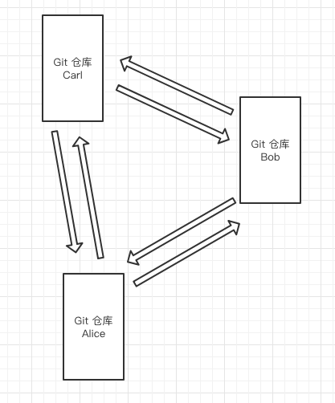

#### Git 介绍

- Git 是一个用于控制管理代码历史版本的工具，区别于集中式的 SVN，Git 使用了分布式的管理方式。
- 团队每人都拥有一个自己的本地仓库，不仅可以自己本地进行版本管理，也可以将代码版本在各个成员间共享。



#### GitHub Desktop

GitHub Desktop -- 是 Git 官方出品的可视化工具，方便操作，通俗易懂,[官网下载入口](https://desktop.github.com/)


#### 初始化一个 Git 仓库

```js
git init
Initialized empty Git repository in /path/to/work/directory/.git/
```

- 这样你就可以得到一个本地仓库了，你会看到工作目录下已经新增了一个   _.git_ 目录。
- _注：某些系统中可能预设隐藏以 . 开头的文件夹，可能需要开启相关设置才能看到_

\*\*

#### 查看与设置用户名和邮箱

```js
//查看
git config --global user.name
git config --global user.email

//设置
git config --global user.name "你的git名称"  (设置name)
git config --global user.email "你的git验证邮箱"  (设置邮箱)
```

#### 添加文件

```js
//添加全部文件
git add .

//提交跟新部分
git add -A
```

#### 提交文件

```js
git commit -m '提交备注'
```

#### 撤销缓存区代码

推荐：git reset --mixed HEAD^

```js
git reset --hard HEAD^		删除工作空间改动代码，撤销commit,撤销git add .
git reset --mixed HEAD^		不删除工作空间代码，撤销commit，也撤销git add .
git reset --soft HEAD^		不删除工作空间代码，撤销commit，不撤销git add .
```

#### 查看仓库状态

```js
git status
```

#### 文件保存到暂存区

```js
git stash					//可以将当前的工作状态保存到git栈，在需要的时候再恢复
git stash pop 		//默认恢复git栈中最新的一个stash@{num}，建议在git栈中只有一条的时候使用，以免混乱
git stash list		//查看所有被隐藏的文件列表
git stash apply		//恢复被隐藏的文件，但是git栈中的这个不删除，用法：git stash apply stash@{0}，如果我们在git stash apply 的时候工作目录下的文件一部分已经加入了暂存区，部分文件没有，当我们执行git stash apply之后发现所有的文件都变成了未暂存的，如果想维持原来的样子，即暂存过的依旧是暂存状态，那么可以使用 git stash apply --index
git stash drop		//删除指定的一个进度，默认删除最新的进度，使用方法如git stash drop stash@{0}
git stash clear		//删除所有存储的进度
git stash show		//显示stash的内容具体是什么，使用方法如 git stash show stash@{0}
git stash --help	//查看帮助
```

#### 连接远程仓库

```js
git remote add origin '仓库地址'
```

#### 查看连接仓库状态

```js
git remote -v
```

#### 删除远程仓库

```js
git remote rm origin
```

#### 克隆代码到本地

```js
//默认master
git clone '仓库地址'

//克隆指定分支 branch:分支名
git clone -b branch '仓库地址'
```

#### 查看分支

```js
//查看远程分支
git branch -r

//查看所有分支
git branch -a
```

#### 新建分支

```js
git branch '分支名'
```

#### 新建分支并切换到新建分支

```js
git checkout -b '分支名'
```

#### 切换分支

```js
git checkout '分支名'

//切换到上一个分支
git checkout -
```

#### 合并分支

```js
//首先切到master上，再进行合并
git checkout master
git merge '分支名'
```

#### 撤回合并分支

```js
  git reset --merge ' 版本'
```

#### 删除本地分支

```js
git branch -d '分支名'
```

#### 删除远程分支

```js
git push origin --delete '分支名'
```

#### 解决冲突

```js
git status找到冲突的地方，修改后再次提交

推荐push代码步骤

git pull	远程代码和本地没有修改同个文件或冲突可以直接拉去远程最新代码
git add -A
git commit-m 'feat: '
git pull 当第一个步骤没拉取成功这个要再次执行，没有冲突直接提交，有冲突找到冲突文件解决
git add -A git commit-m 'feat: ' 有冲突解决后执行
git push origin 分支
```

#### 更新代码

```js
//拉取远程代码与本地分支合并,实际是fetch+merge
git pull

//会把远程仓库所有的更新拉取下来,不会合并
git fetch

// 可以确保生产分支commit是一个线性结构，方便rollback。其实生产也可以选择打tag来发布
// 注：通过rebase可以确保主分支commit history线性结构上每个commit点都是相对独立完整的功能单元。除了美感，这样做也有助于团队间的分工协作，比随便merge效果好。
git rebase

// 1、把本地 repo. 从上次 pull 之后的变更暂存 2、恢复到上次 pull 时的状态 3、.合并远端的变更到本地  4、最后再合并刚刚暂存下來的本地变更
git pull --rebase（推荐用这个）
```

示例代码

```bash
# 确保工作目录干净
git stash

# 拉取远程代码并尝试 rebase
git pull --rebase origin main

# 如果遇到冲突，解决冲突后继续 rebase
git add .
git rebase --continue

# 完成 rebase 后，推送更改到远程仓库
git push origin main

# 如果之前保存了更改，现在恢复它们
git stash pop
```

#### 代码推送到远程仓库

```js
git push origin '分支名'
```

####

#### 代码回滚

```js
git log

commit b27f56adaaa05a50d68a2072b60e7469dcb4521c
Author: YangWenlong123 <496192903@qq.com>
Date:   Fri Jul 17 16:57:21 2020 +0800


git reset --hard b27f56adaaa05a50d68a2072b60e7469dcb4521c	//可以通过git log查看
```

#### 代码回滚后推送仓库

```js
git push --force-with-lease origin feature-branch

是一个更安全的强制推送选项，它在执行强制推送之前会检查远程分支是否已经被其他人更新。如果远程分支已经被更新，--force-with-lease将拒绝执行强制推送，以防止覆盖其他人的工作。这是一个避免误操作覆盖他人更改的有效方法
```

#### 常见问题

```
hint: Updates were rejected because the tip of your current branch is behind

hint: its remote counterpart. Integrate the remote changes (e.g.

hint: 'git pull ...') before pushing again.

hint: See the 'Note about fast-forwards' in 'git push --help' for details.
```

原因：你的远程仓库的分支比本地的代码要新所以有冲突。

解决：

```js
git push -u origin master -f （多人开发需谨慎）
```

A lock file already exists in the repository, which blocks this operation from completing

解决： 在文件的.git 文件中 有个 index.lock 文件。把它删除掉就行了

.gitignore 文件不生效

原因：第一次提交代码没有添加这个文件

解决：

```js
git rm -r --cached .

git add .

git commit -m 'update .gitignore'
```

#### stash changes 的用法

restore

<https://www.cnblogs.com/caibaotimes/p/13904774.html>

discard

丢弃当前文件修改的内容

#### 文章

git revert 回滚操作：<https://www.jianshu.com/p/5e7ee87241e4>

git 异常处理清单: <https://juejin.im/post/5edcf3a36fb9a047fa04fbc3>

git 命令：<https://www.coderutil.com/article?id=120>
