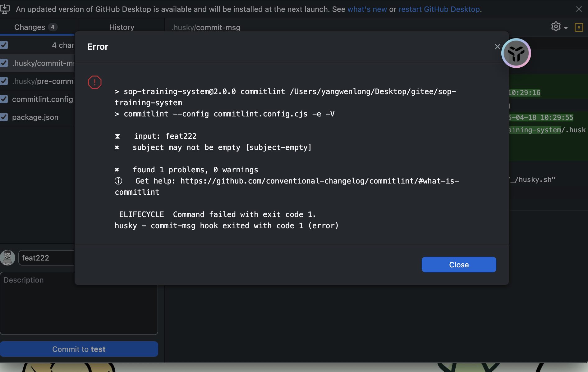
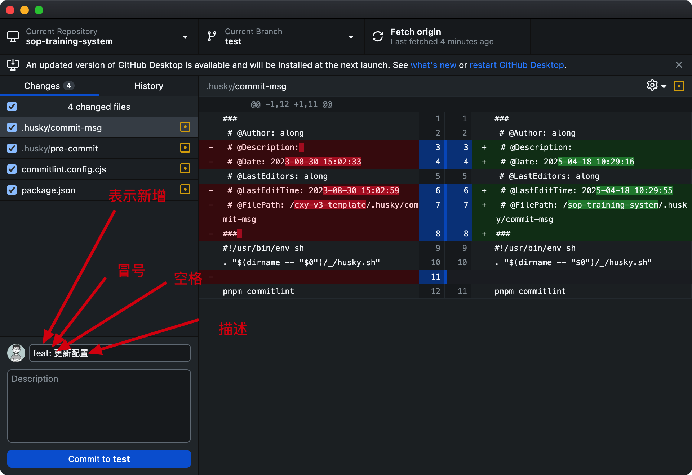

# Commit message 格式

```js
<type>(<scope>): <subject>
<BLANK LINE>
<body>
<BLANK LINE>
<footer>
```

其中，Header 是必需的，Body 和 Footer 可以省略。

不管是哪一个部分，任何一行都不得超过 100 个字符。这是为了避免自动换行影响美观。

- 标题行(第一行/header): 必填, 描述主要修改类型和内容
- 主题内容(body): 描述为什么修改, 做了什么样的修改, 以及开发的思路等等
- 页脚注释(footer): 放 Breaking Changes 或 Closed Issues
- scope: commit 影响的范围, 比如: route, component, utils, build...
- subject: commit 的概述
- body: commit 具体修改内容, 可以分为多行
- footer: 一些备注, 通常是 BREAKING CHANGE 或修复的 bug 的链接.

## Header

Header 部分只有一行，包括三个字段：type（必需）、scope（可选）和 subject（必需）。

## type（用于说明 commit 的类别）

- feat：新增功能
- fix：bug 修复
- docs：文档更新
- style：不影响程序逻辑的代码修改(修改空白字符，格式缩进，补全缺失的分号等，没有改变代码逻辑)
- refactor：重构代码(既没有新增功能，也没有修复 bug)
- perf：性能, 体验优化
- test：新增测试用例或是更新现有测试
- build：主要目的是修改项目构建系统(例如 glup，webpack，rollup 的配置等)的提交
- ci：主要目的是修改项目继续集成流程(例如 Travis，Jenkins，GitLab CI，Circle 等)的提交
- chore：不属于以上类型的其他类，比如构建流程, 依赖管理构建过程或辅助工具的变动
- revert：回滚某个更早之前的提交

## scope[optional]表示改动的模块或者文件或者功能

## subject （提交简短的问题描述）

- 以动词开头，使用第一人称现在时，比如 change，而不是 changed 或 changes
- 第一个字母小写
- 结尾不加句号（.）

## Body

Body 部分是对本次 commit 的详细描述，可以分成多行。

## Footer

- 不兼容变动
  如果当前代码与上一个版本不兼容，则 Footer 部分以 BREAKING CHANGE 开头，后面是对变动的描述、以及变动理由和迁移方法。
- 关闭 Issue
  如果当前 commit 针对某个 issue，那么可以在 Footer 部分关闭这个 issue 。

# 例子

```js
git commit -m 'fix: 修复xxx页面跳转异常'
```

# 接入

## 安装 husky

```bash
pnpm install -D husky
```

## 生成 husky 配置文件

```bash
npx husky-init
```

执行此命令后会在根目录下生成个一个`.husky`目录，在这个目录下面会有一个`pre-commit`文件，内容如下。这个文件里面的命令在我们执行`commit`的时候就会执行

```bash
#!/usr/bin/env sh
. "$(dirname -- "$0")/_/husky.sh"

## pnpm format  这个先注释

```

## 安装 commitlint

```bash
pnpm add @commitlint/config-conventional @commitlint/cli -D
```

## 新建 commitlint 配置文件

在项目根目录下新建 commitlint.config.cjs 文件，并填入如下代码：

```bash
module.exports = {
  extends: ['@commitlint/config-conventional'],
  // 校验规则
  rules: {
    'type-enum': [
      2,
      'always',
      [
        'feat',
        'fix',
        'docs',
        'style',
        'refactor',
        'perf',
        'test',
        'chore',
        'revert',
        'build',
      ],
    ],
    'type-case': [0],
    'type-empty': [0],
    'scope-empty': [0],
    'scope-case': [0],
    'subject-full-stop': [0, 'never'],
    'subject-case': [0, 'never'],
    'header-max-length': [0, 'always', 72],
  },
}
```

## 添加脚本

在 packjson.json 文件的 script 字段中添加命令

```bash
 "commitlint": "commitlint --config commitlint.config.cjs -e -V"
```

## 搭配 husky 来使用

```bash
npx husky add .husky/commit-msg
```

在根目录下 husky 文件夹中的 commit-msg 中添加如下命令

```bash
#!/usr/bin/env sh
. "$(dirname -- "$0")/_/husky.sh"
pnpm commitlint

```

# 提交规范

错误的提交



`提交示范：git commit -m 'feat: 新增商品页查询功能’ 此处并非只能用 feat 作为前缀，还能使用其他前缀，详情见 步骤7.2`


