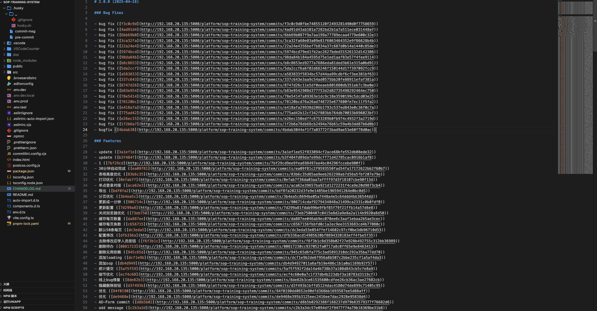

## 前言

从 git 元数据生成 CHANGELOG。

## 安装

```bash
pnpm i conventional-changelog-cli --save-dev
```

## 配置

```json
"scripts": {
    "changelog": "conventional-changelog -p angular -u -i CHANGELOG.md -s -r 0"
}
```

## 生成文件

```bash
pnpm changelog
```


