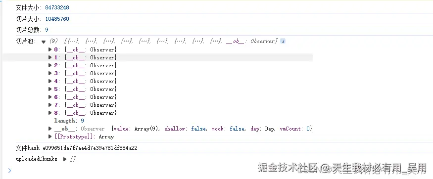

在 Web 开发中，文件上传是一个常见的功能需求，尤其是当涉及到大文件上传时，为了提高上传的稳定性和效率，文件切片上传技术便显得尤为重要。通过将大文件切分成多个小块（切片）进行上传，不仅可以有效减少单次上传的数据量，降低网络波动对上传过程的影响，还能实现如断点续传、秒传等高级功能。本文将以`Vue`为框架，配合 `Axios` 进行 `HTTP` 请求，详细介绍如何实现一个支持文件切片上传的功能。

## 前端准备工作

在开始编码之前，请确保你的项目中已经安装了 `axios` 和 `spark-md5` 两个库。`axios` 用于发起网络请求，`spark-md5` 用于计算文件的 `MD5` 值，从而支持秒传和断点续传功能。

### 前端需要实现的功能

1.  文件选择和限制：

    > 通过`<input type="file" @change="handleFileChange" accept="video/*" />`实现了文件的选择，同时限制了用户只能选择视频文件进行上传。

1.  计算文件的 MD5 值

    > 在`computeFileHash`方法中，利用`SparkMD5`库计算用户选中文件的`MD5`值。这一步是为了之后能够校验文件的完整性和唯一性。

1.  校验文件是否需要上传

    > 在`checkFile`方法中，通过向服务器查询文件的`MD5`值，判断该文件是否已经上传过，以此实现秒传功能，避免重复上传相同文件。

1.  文件切片

    > 在`sliceFileAndUpload`方法中，将大文件切割成多个小片段（切片），这样做的目的是为了支持大文件的分块上传，提高上传效率，同时也便于出错时重新上传单个切片而不是整个文件。

1.  并发上传切片

    > 通过`processPool`和`uploadChunk`方法实现切片的并发上传，限制了最大并发数`(MAX_REQUEST)`，以免过多并发请求压崩服务器。

1.  上传进度反馈

    > 通过`uploadProgress`数据和模板中的进度显示，用户可以实时看到文件上传的进度。

1.  服务器通知合并切片

    > 在所有切片上传完成后，通过`notifyServerToMerge`方法向服务器发送通知，请求服务器端进行切片的合并，以重建原始文件。

## 后端需要支持的 API 接口

为了支持前端的大文件上传和处理逻辑，后端需要提供以下 API 接口：

1.  文件校验 API

> - 功能：检查文件的完整性和上传状态。这通常通过文件的唯一标识（如 MD5 哈希值）来实现。
> - 输入参数：文件唯一标识（如 MD5 哈希值）。
> - 返回值：告知客户端该文件是否已经存在，如果存在，是否完整。如果文件已经存在且不完整，则返回已上传的切片信息。

2.  切片上传 API

> - 功能：接收文件的单个切片，并保存到服务器的临时存储位置。
> - 输入参数：文件的唯一标识，切片内容，切片的序号。
> - 返回值：确认切片上传成功或失败的状态。

3.  切片合并 API

> - 功能：将所有上传的切片合并成一个完整的文件。
> - 输入参数：文件的唯一标识，可能还包括文件名、总切片数等信息。
> - 返回值：合并操作的成功或失败状态，以及最终文件的访问 URL（可选）。

4.  上传进度查询 API

> - 功能：查询文件上传的进度，这对于恢复上传和提供用户反馈非常有用。
> - 输入参数：文件的唯一标识。
> - 返回值：已上传的切片列表或上传进度百分比。

这些 API 合起来支持了一个分块上传文件的完整流程，包括文件的`校验`、`切片的上传`、`切片的合并`，以及`上传进度查询`。这个流程可以`有效地处理大文件上传，减少网络传输的负担，提高上传的可靠性，并允许上传过程中的暂停和恢复`。

### 执行流程

一开始用户通过界面选择一个文件进行上传，进行文件选择，用户通过文件选择框悬着一个大文件，比如视频文件，触发`handleFileChange`方法，然后再计算这个大文件的 MD5，使用`computeFileHash`方法计算选中文件的 MD5 哈希值，计算完成后检查文件是否需要上传，向服务器发起请求，根据文件的 MD5 哈希值执行`checkFile`方法检查文件是否已经存在，如果文件已经存在通知用户`秒传功能`并将上传进度设为 100%，如果文件需要上传，则使用`sliceFileAndUpload`方法将文件切成很多个小块，每个切片及其索引都被添加到`requestPool`请求池中，从`requestPool`中并发上传切片`processPool`方法，对每个切片调用`uploadChunk`方法进行实际上传，通过`MAX_REQUEST`控制并发上传的数量，没上传一个切片，`uploadChunksCount`增加，并更新上传进度。所有切片上传完成后，通知服务器合并这些切片`notifyServerToMerge`，当服务器成功合并所有切片成原始后，整个切片上传流程完成。

## 实现步骤

### 步骤一:用户选择文件

用户通过 `<input type="file">` 选择文件后，`handleFileChange` 事件被触发。在这个事件处理函数中，我们首先获取到用户选择的文件，然后计算文件的 `MD5` 值，以此作为文件的唯一标识。这一步是实现`断点续传`和`秒传`功能的关键。

```javascript
<template>
  <div>
    <!-- 文件选择框，仅接受视频文件 -->
    <input type="file" @change="handleFileChange" accept="video/*" />
    <!-- 上传按钮 -->
    <button @click="handleUpload">Upload</button>
    <!-- 上传进度显示 -->
    <div v-if="uploadProgress > 0">
      Upload Progress: {{ uploadProgress }}%
    </div>
  </div>
</template>
```

### 步骤二：计算文件 `MD5`

使用 `spark-md5` 库计算文件的 `MD5` 值。通过`FileReader API` 读取文件内容，然后计算其 `MD5` 值。这个过程可能会花费一些时间，因此使用 `Promise` 来异步处理。

```javascript
async computeFileHash(file) {
  const spark = new SparkMD5.ArrayBuffer();
  const fileReader = new FileReader();
  return new Promise((resolve) => {
    fileReader.onload = (e) => {
      spark.append(e.target.result);
      const hash = spark.end();
      resolve(hash);
    };
    fileReader.readAsArrayBuffer(file);
  });
}
```

### 步骤三：检查文件状态，检查文件是否已经上传还是部分上传

在上传文件之前，先向服务器发送请求，检查这个文件是否已经部分或全部上传过。这一步是实现断点续传的关键。服务器根据文件的 `MD5` 值返回已上传的切片信息或表示文件完全上传的状态。

```javascript
 // 向服务器查询文件是否已经部分或完全上传
async checkFile(fileHash) {
 <---  此处应替换为你的接口调用代码  --->
 // 假设接口返回 { shouldUpload: boolean, uploadedChunks: Array<number> }
  return { shouldUpload: true, uploadedChunks: [] };
},
```

### 步骤四：切片并准备上传

根据服务器返回的信息，如果文件未完全上传，我们将文件分割成多个切片。然后根据已上传的切片信息，跳过那些已经上传的切片，仅上传剩余的切片。          切片并准备上传在`sliceFileAndUpload`方法中实现。这个方法首先计算了整个文件应该被分割成多少切片（基于设定的切片大小），然后根据服务器返回的已上传切片信息`（uploadedChunks）`，它会跳过这些已经上传的切片，只将剩余的切片添加到请求池`（requestPool）`中准备上传。

```javascript
 // 切片并准备上传
sliceFileAndUpload(fileHash, uploadedChunks) {
    const chunkSize = 10 * 1024 * 1024; // 切片大小，这里是10MB
    this.chunkCount = Math.ceil(this.selectedFile.size / chunkSize); // 计算总切片数
    this.uploadProgress = 0; // 重置上传进度
    for (let i = 0; i < this.chunkCount; i++) {
      if (uploadedChunks.includes(i)) continue; // 跳过已上传的切片
      const chunk = this.selectedFile.slice(i * chunkSize, (i + 1) * chunkSize); // 获取切片
      this.requestPool.push({ chunk, index: i }); // 加入请求池
    }
    this.processPool(fileHash); // 开始处理请求池
  },
```

上面这段代码中，`uploadedChunks`参数是一个数组，包含了所有已上传切片的索引。通过检查当前切片的索引是否包含在这个数组中，代码决定是否跳过当前切片的上传。如果索引不在`uploadedChunks`中，这意味着该切片还没有被上传，因此需要将其添加到`requestPool`中等待上传。这样，只有那些未上传的切片会被实际上传，从而实现了断点续传的功能。`processPool`进行并发切片上传

### 步骤五：并发上传切片

为了提高上传效率，我们使用并发上传的方式。设置最大并发数，控制同时上传的切片数量。通过逐一上传切片，并监听每个上传请求的完成，从而动态调整并发请求。          并发上传切片的逻辑主要在`processPool`方法中实现。这个方法负责管理并发请求，确保同时只有一定数量的上传请求在处理中。这通过一个简单的请求池`（requestPool）`和控制最大并发数量`（MAX_REQUEST）`来实现。

```javascript
// 处理请求池中的切片上传
processPool(fileHash) {
  while (this.requestPool.length > 0 && this.MAX_REQUEST > 0) {
    const { chunk, index } = this.requestPool.shift(); // 取出一个待上传的切片
    this.uploadChunk(chunk, fileHash, index) // 上传切片
      .then(() => {
        this.uploadedChunksCount++; // 更新已上传切片数量
        this.uploadProgress = ((this.uploadedChunksCount / this.chunkCount) * 100).toFixed(2); // 更新上传进度
        if (this.requestPool.length > 0) {
          this.processPool(fileHash); // 继续处理请求池
        } else if (this.uploadedChunksCount === this.chunkCount) {
          // 所有切片都已上传，通知服务器合并
          this.notifyServerToMerge(fileHash);
        }
      })
      .finally(() => {
        this.MAX_REQUEST++; // 释放一个请求槽
      });
    this.MAX_REQUEST--; // 占用一个请求槽
  }
},
```

在这个方法中，`while`循环检查请求池中是否还有待处理的切片，并且当前活跃的请求数量是否小于允许的最大并发数量`MAX_REQUEST`。如果这两个条件都满足，它会从请求池中取出一个切片，并调用`uploadChunk`方法来上传它，同时减少`MAX_REQUEST`的值来反映一个新的请求已经开始。          当一个切片上传完成后，`then`回调函数会增加已上传切片的计数并更新上传进度。如果请求池中还有待上传的切片，它会递归调用`processPool`来处理下一个切片。一旦所有切片都上传完成，它会调用`notifyServerToMerge`来通知服务器所有切片已经上传完毕，可以合并成一个完整的文件。通过这种方式，代码能够在保持最大并发限制的同时，高效地处理切片的上传。

### 步骤六：服务器合并切片

所有切片上传完成后，客户端向服务器发送一个合并切片的请求。服务器接收到请求后，将所有切片合并成原始文件，并返回合并结果。

```javascript
// 通知服务器合并切片
notifyServerToMerge(fileHash) {
  // 通知服务器合并切片，应替换为真实的合并API调用
  console.log(`通知服务器将文件与哈希合并: ${fileHash}`);
},
```

一个 API 调用，向服务器发送一个请求来触发合并已上传切片的操作。这个请求通常会携带一些必要的信息，比如文件的唯一标识（在这个例子中是`fileHash`），以及可能还有其他诸如`文件名`、`文件大小`、`切片数量`等信息，这些信息取决于服务器端合并切片的具体要求。          服务器收到合并请求后，会根据提供的信息找到所有相关的切片，按正确的顺序将它们合并成一个完整的文件，并将该文件存储在服务器上的适当位置。完成这个过程后，服务器可能还会向客户端发送一个响应，通知合并操作的结果（成功或失败），以及可能的后续步骤或需要的信息。          通过上述步骤，实现了一个高效稳定的大文件上传功能，极大提升了用户体验。

## 全部代码

```javascript
<template>
  <div>
    <!-- 文件选择框，仅接受视频文件 -->
    <input type="file" @change="handleFileChange" accept="video/*" />
    <!-- 上传按钮 -->
    <button @click="handleUpload">Upload</button>
    <!-- 上传进度显示 -->
    <div v-if="uploadProgress > 0">
      Upload Progress: {{ uploadProgress }}%
    </div>
  </div>
</template>

<script>
import axios from "axios";
import SparkMD5 from "spark-md5"; // 引入SparkMD5用于计算文件的MD5值

export default {
  data() {
    return {
      selectedFile: null, // 用户选择的文件
      uploadProgress: 0, // 上传进度
      requestPool: [], // 请求池，存储待上传的切片信息
      MAX_REQUEST: 6, // 最大并发请求数量
      chunkCount: 0, // 文件切片总数
      uploadedChunksCount: 0, // 已上传的切片数量
    };
  },
  methods: {
    // 处理文件选择事件
    async handleFileChange(event) {
      this.selectedFile = event.target.files[0];
      if (!this.selectedFile) return; // 未选择文件则返回
      // 可以在这里添加文件格式校验
      const fileHash = await this.computeFileHash(this.selectedFile); // 计算文件hash
      const { shouldUpload, uploadedChunks } = await this.checkFile(fileHash); // 检查文件是否需要上传
      if (!shouldUpload) {
        alert("文件已存在，秒传成功！");
        this.uploadProgress = 100; // 直接设置进度为100%
        return;
      }
      this.sliceFileAndUpload(fileHash, uploadedChunks); // 切片并上传
    },
    // 计算文件的MD5
    computeFileHash(file) {
      return new Promise((resolve) => {
        const spark = new SparkMD5.ArrayBuffer();
        const fileReader = new FileReader();
        fileReader.onload = (e) => {
          spark.append(e.target.result);
          const hash = spark.end();
          resolve(hash); // 返回计算得到的hash值
        };
        fileReader.readAsArrayBuffer(file);
      });
    },
    // 检查文件是否已经上传过
    async checkFile(fileHash) {
      // 应替换为真实的API调用来检查文件状态
      return { shouldUpload: true, uploadedChunks: [] }; // 模拟返回值
    },
    // 切片并准备上传
    sliceFileAndUpload(fileHash, uploadedChunks) {
      const chunkSize = 10 * 1024 * 1024; // 切片大小，这里是10MB
      this.chunkCount = Math.ceil(this.selectedFile.size / chunkSize); // 计算总切片数
      this.uploadProgress = 0; // 重置上传进度
      for (let i = 0; i < this.chunkCount; i++) {
        if (uploadedChunks.includes(i)) continue; // 跳过已上传的切片
        const chunk = this.selectedFile.slice(i * chunkSize, (i + 1) * chunkSize); // 获取切片
        this.requestPool.push({ chunk, index: i }); // 加入请求池
      }
      this.processPool(fileHash); // 开始处理请求池
    },
    // 处理请求池中的切片上传
    processPool(fileHash) {
      while (this.requestPool.length > 0 && this.MAX_REQUEST > 0) {
        const { chunk, index } = this.requestPool.shift(); // 取出一个待上传的切片
        this.uploadChunk(chunk, fileHash, index) // 上传切片
          .then(() => {
            this.uploadedChunksCount++; // 更新已上传切片数量
            this.uploadProgress = ((this.uploadedChunksCount / this.chunkCount) * 100).toFixed(2); // 更新上传进度
            if (this.requestPool.length > 0) {
              this.processPool(fileHash); // 继续处理请求池
            } else if (this.uploadedChunksCount === this.chunkCount) {
              // 所有切片都已上传，通知服务器合并
              this.notifyServerToMerge(fileHash);
            }
          })
          .finally(() => {
            this.MAX_REQUEST++; // 释放一个请求槽
          });
        this.MAX_REQUEST--; // 占用一个请求槽
      }
    },
    // 上传单个切片
    async uploadChunk(chunk, fileHash, index) {
      const formData = new FormData();
      formData.append("chunk", chunk);
      formData.append("hash", fileHash);
      formData.append("index", index);
      // 替换为真实的上传URL，并根据需要实现onUploadProgress
      await axios.post("上传URL", formData);
    },
    // 通知服务器合并切片
    notifyServerToMerge(fileHash) {
      // 通知服务器合并切片，应替换为真实的合并API调用
      console.log(`通知服务器将文件与哈希合并: ${fileHash}`);
    },
  },
};
</script>
```

效果：
