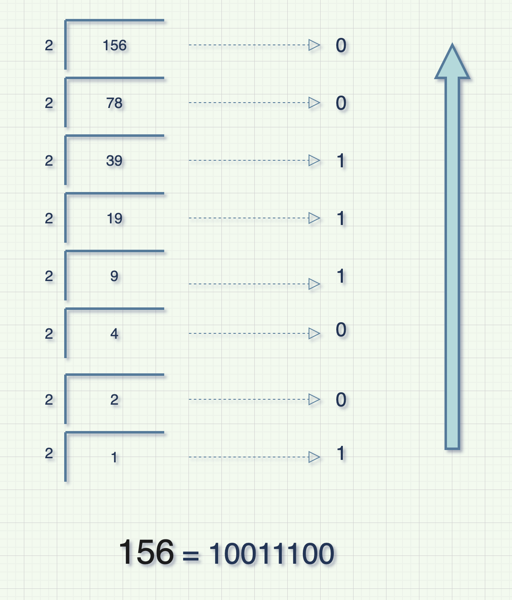
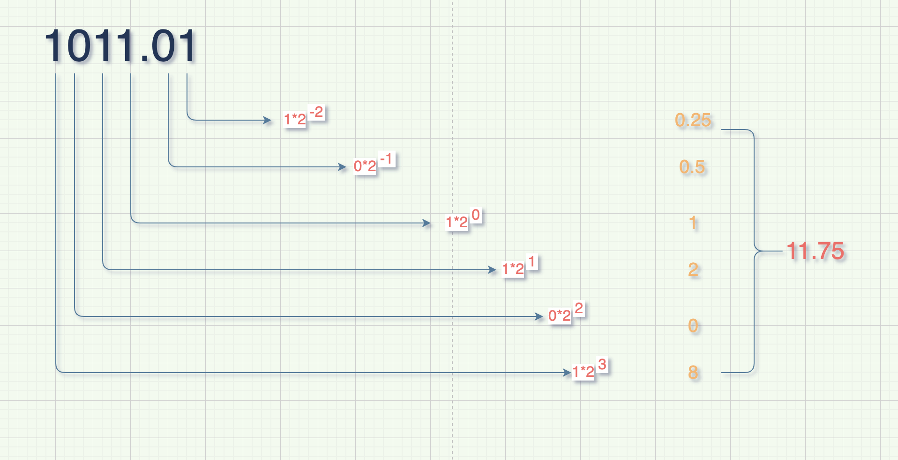
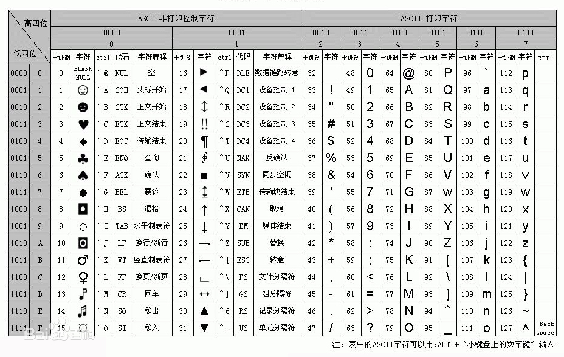
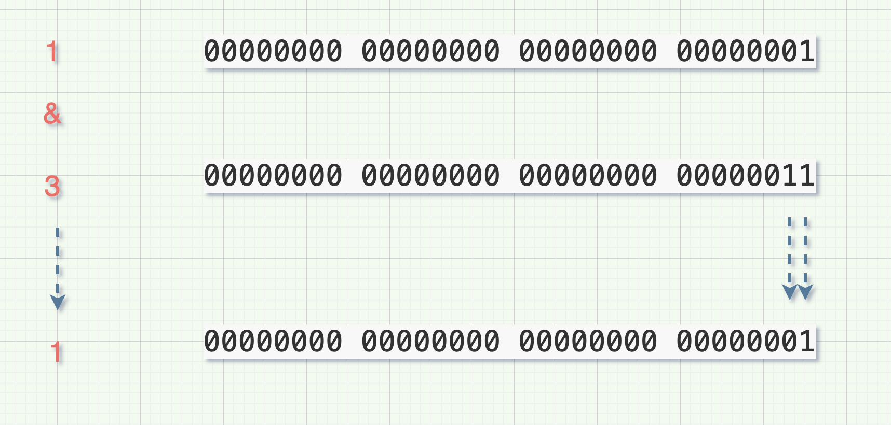
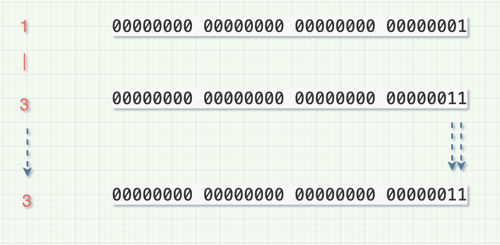
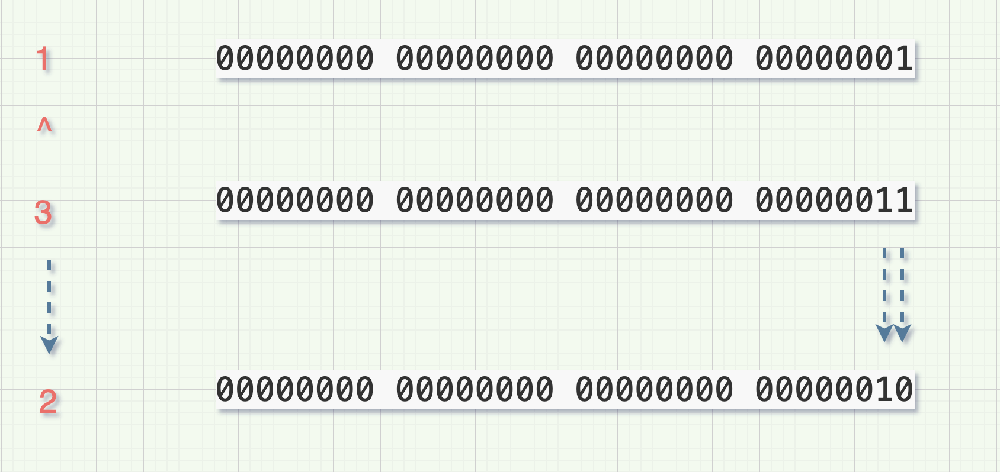
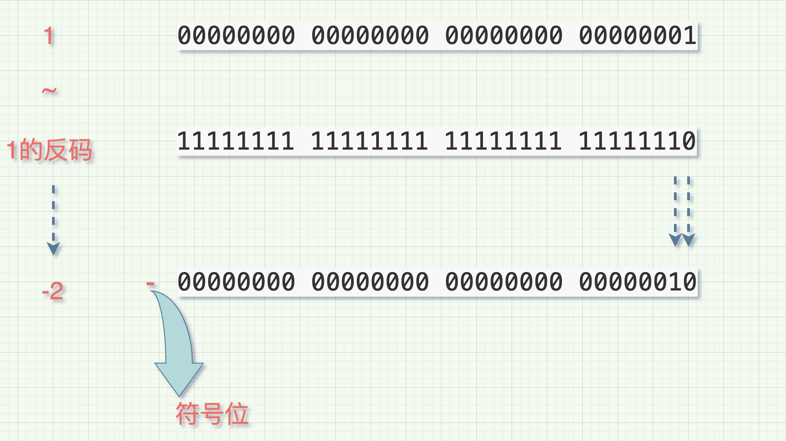
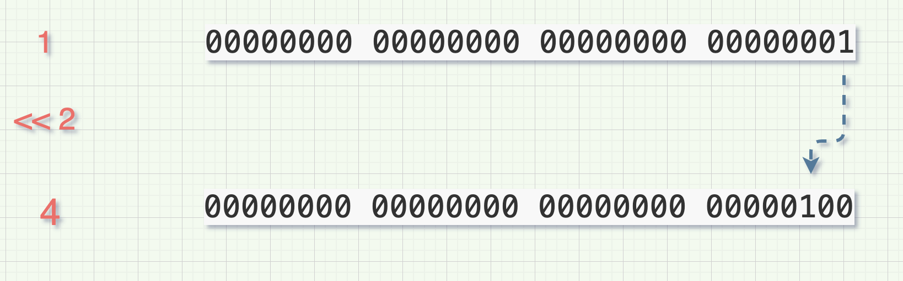
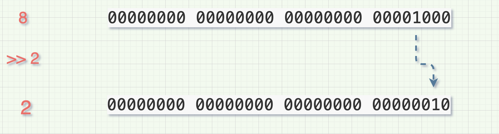
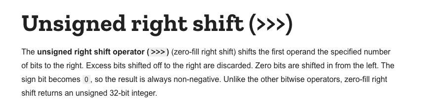

### encodeURI

- encodeURI(URlstring), 函数可把字符串作为 URI 进行编码
- 该方法不会对 ASCII 字母和数字进行编码,也不会对这些 ASCII 标点符号进行编码: -\_.!~\*'().
- 如果 URL 中含有分隔符,比如?和#,应该使用 encodeURIComponent()方法进行编码.

```js
encodeURI('你好 某某');	--> %E4%BD%A0%E5%A5%BD%20%E5%AD%90%E6%99%B4
```

### decodeURIComponent/encodeURIComponent

decodeURIComponent() 函数可对 encodeURIComponent() 函数编码的 URI 进行解码。[在线测试](https://www.sojson.com/encodeurl.html)

```js
encodeURIComponent('http://www.along.ink')				http%3A%2F%2Fwww.along.ink
decodeURIComponent('http%3A%2F%2Fwww.along.ink')	http://www.along.ink
```

### 十进制转二进制

十进制转换为二进制整数采用的除 2 取余，逆序排列

NumberObject.toString(radix); radixke 可选，2-36 之间的整数，默认为 10.当 radixke 为 2 时，原始值会被转换为二进制的字符串。



```js
for(let i=0; i<= 10; i++) {
    console.log(i.toString(2))
}

//执行结果
0		0
1		1
1		10
3		11
4		100
5		101
6		110
7		111
8		1000
9		1001
10	1010
```

### 二进制转十进制

小数点前或者整数要从右到左用二进制的每个数去乘以 2 的相应次方并递增,小数点后则是从左往右乘以二的相应负次方并递减。

parsentInt(string,radix); string 必选，需要解析的字符串,radix 为可选，表示要解析的数字的基数。2-36 之前。默认为 10.



```js
for(let i=0; i<= 10; i++) {
    let number = i.toString(2);

    console.log(parseInt(number, 2));
}

//执行结果
0 1 2 3 4 5 6 7 8 9 10
```

### 其它进制转换

```js
parseInt(num, 8); //八进制转十进制
parseInt(num, 16); //十六进制转十进制
parseInt(num).toString(8); //十进制转八进制
parseInt(num).toString(16); //十进制转十六进制
parseInt(num, 2).toString(8); //二进制转八进制
parseInt(num, 2).toString(16); //二进制转十六进制
parseInt(num, 8).toString(2); //八进制转二进制
parseInt(num, 8).toString(16); //八进制转十六进制
parseInt(num, 16).toString(2); //十六进制转二进制
parseInt(num, 16).toString(8); //十六进制转八进制
```

### Unicode 编码与中文相互转换

中文转 unicode 编码

```js
const str = '子晴';

escape(str).replace(/%u/g,'\u');

//结果
\u5B50\u6674
```

unicode 编码转中文

```js
const str = '\u5B50\u6674';

eval("'" + unicode + "'");

//结果
子晴;
```

### escape 编码与 unescape 解码

unescape() 函数可对通过 escape() 编码的字符串进行解码。

```js
let str = '子晴';

escape(str); //%u5B50%u6674 可通过正则匹配替换为unicode编码
unescape(escape(str)); //子晴
```

escape-html 和 html-escaper

```js
npm i escape-html

var escape = require('escape-html');
var html = escape('foo & bar');
// -> foo &amp; bar
```

```js
npm i html-escaper

import {escape, unescape} from 'html-escaper';

escape('string');
unescape('escaped string');
```

### fromCharCode/fromCodePoint 编码

fromCharCode() 可接受一个指定的 Unicode 值，然后返回一个字符串。

```js
String.fromCharCode(numX,numX,...,numX); 必须，一个或者多个

String.fromCharCode('56');		// 8
```

```js
String.fromCodePoint(num1[, ...[, numN]]);必须，一个或者多个

String.fromCodePoint('42');		//*
```

Unicode 字符表



### 英文大小写

```js
'yang'.toUpperCase(); //YANG

'YANG'.toLocaleLowerCase(); //yang
```

### JSON.parse 和 stringify

序列化和反序列化

```js
let obj = {
  name: 'along',
};
typeof obj; //object
typeof JSON.stringify(obj); //string
typeof JSON.parse(JSON.stringify(obj)); //object
```

##

### 位运算

位运算是直接对二进制位进行计算，它直接处理每一个比特位，是非常底层的运算，好处是速度极快，缺点是很不直观，许多场合不能够使用。
位运算只对整数起作用，如果一个运算数不是整数，会自动转为整数后再运行。
在 JavaScript 内部，数值都是以 64 位浮点数的形式储存，但是做位运算的时候，是以 32 位带符号的整数进行运算的，并且返回值也是一个 32 位带符号的整数。

| **运算符**         | **用法** | **描述**                                                                          |
| ------------------ | -------- | --------------------------------------------------------------------------------- |
| 按位与（AND）      | a & b    | 对于每一个比特位，只有两个操作数相应的比特位都是 1 时，结果才为 1，否则为 0。     |
| 按位或（OR）       | a 1 b    | 对于每一个比特位，当两个操作数相应的比特位至少有一个 1 时，结果为 1，否则为 0。   |
| 按位异或（XOR）    | a ^ b    | 对于每一个比特位，当两个操作数相应的比特位有且只有一个 1 时，结果为 1，否则为 0。 |
| 按位非（NOT）      | ~ a      | 反转操作数的比特位，即 0 变成 1，1 变成 0。                                       |
| 左移（Left shift） | a << b   | 将 a 的二进制形式向左移 b (< 32) 比特位，右边用 0 填充。                          |
| 有符号右移         | a >> b   | 将 a 的二进制表示向右移 b (< 32) 位，丢弃被移出的位。                             |
| 无符号右移         | a >>> b  | 对于每一个比特位，只有两个操作数相应的比特位都是 1 时，结果才为 1，否则为 0。     |

## 按位与(AND) &

&运算符(按位与)用于对两个二进制操作数逐位进行比较。如果对应的位都为 1，那么结果就是 1，如果任意一个位是 0，则结果就是 0.


## 按位或(OR) |

|运算符(按位或)用于对两个二进制操作数逐位进行比较。只要两个对应位中有一个 1 时就为 1，否则为 0。



## 按位异或(XOR) ^

^运算符（位异或）用于对两个二进制操作数逐位进行比较。只有两个对应位不同时才为 1。



## 按位非(NOT) ～

~运算符（位非）用于对两个二进制操作数逐位进行比较。对位求反，1 变 0, 0 变 1。

小技巧：一个数与自身的取反值相加等于-1



## 左移 (Left shift) <<

<<运算符（左移）表示将指定的二进制向左移动指定的位数。



## 有符号右移 (Right shift) >>

> > 运算符（右移）表示将指定的二进制向右移动指定的位数。



## 无符号右移(Unsigned right shift) >>>

很多同学可能会对>>>和>>的区别很好奇，同样我们来看 MDN 上对无符号右移>>>的解释： 

同样，有一个核心词语：zero-fill right shift。翻译过来就是零-填充，这个就更明显了，右移后空位不管你符号位是什么，我都只填 0。

这里就可以得到一个结论：对于非负数，有符号右移和无符号右移总是返回相同的结果。

## 应用场景

- 切换变量 0 或 1

```js
let a = 1;

//一般方法
if(a) {
	a = 0;
} else {
	a = 1;
}

//三木运算符
a = a ? 0 : 1;

//位运算
a ^= 1;  --> 0
```

- 类型转换

```js
//可以把string类型的数值转换为number类型
let a = '888';

~~a ---> 888
```

- 向下取整

```js
console.log(~~8.88); // 8
console.log(8.88 >> 0); // 8
console.log(8.88 << 0); // 8
console.log(8.88 | 0); // 8
// >>>不可对负数取整
console.log(8.88 >>> 0); // 8
```

- 判断一个数的奇偶

```js
// 偶数 & 1 = 0
// 奇数 & 1 = 1
console.log(2 & 1); // 0
console.log(3 & 1); // 1
```

- 交换两个变量值

```js
let a = 1;
let b = 2;

a = a ^ b;
b = a ^ b;
a = a ^ b;
console.log(a,b);  a:2 b:1
```

- 使用&，>>，|来完成 rgb 值和 16 进制颜色值之间的转换

```js
/**
 * 16进制颜色值转RGB
 * @param  {String} hex 16进制颜色字符串
 * @return {String}     RGB颜色字符串
 */
function hexToRGB(hex) {
  var hexx = hex.replace('#', '0x');
  var r = hexx >> 16;
  var g = (hexx >> 8) & 0xff;
  var b = hexx & 0xff;
  return `rgb(${r}, ${g}, ${b})`;
}

/**
 * RGB颜色转16进制颜色
 * @param  {String} rgb RGB进制颜色字符串
 * @return {String}     16进制颜色字符串
 */
function RGBToHex(rgb) {
  var rgbArr = rgb.split(/[^\d]+/);
  var color = (rgbArr[1] << 16) | (rgbArr[2] << 8) | rgbArr[3];
  return '#' + color.toString(16);
}
// -------------------------------------------------
hexToRGB('#ffffff'); // 'rgb(255,255,255)'
RGBToHex('rgb(255,255,255)'); // '#ffffff
```

- 取值 ??运算符，判断左侧值为 null 或者 undefined 时，返回右侧，否则返回左侧

```js
0 ?? 2; // 0
1 ?? 2; // 1
false ?? 2; // false
null ?? 2; // 2
undefined ?? 2; // 2
```

### 其它

## ??、?.、??=

```js
?? 只有左侧的值为null或undefined的时候才使用右侧的值。

1 ?? 2  -> 1
null ?? 2 -> 2

?. 可选链操作符( ?. )允许读取位于连接对象链深处的属性的值，而不必明确验证链中的每个引用是否有效。
操作符的功能类似于 . 链式操作符，不同之处在于，在引用为空(null 或者undefined) 的情况下不会引起错误,该表达式短路返回值


const obj = {
  name: 'ceshi',
  detail: {
    cat: 'huahua'
  }
}
const name = obj.dog ?. name;   undefined

??=		只有当??=左侧的值为undefined、null时，才会把右侧的值赋给左侧，否则左侧不会被赋值

let a;
let b = '123';
let c = 'qwer'
a ??= b;// '123'
b ??= c;// '123'
```
