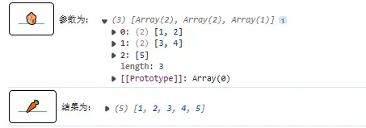
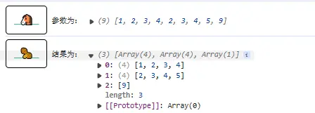
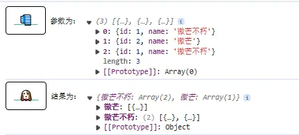

## 求和函数

```js
const sum = (arr) => arr.reduce((acc, cur) => acc + cur, 0);
//累计值为acc
//当前值为cur
//初始值为initialValue 为0
let arr = [1, 2, 3, 4, 5];
console.log('参数为：', arr);
console.log('总和为：', sum(arr));
```


## 求积函数

```js
const product = (arr) => arr.reduce((acc, curr) => acc * curr, 1);
let arr1 = [1, 2, 3, 4, 5];
console.log('参数为：', arr1);
console.log('乘积为：', product(arr1));
```


## 扁平化数组

```js
const flatten = (arr) => arr.reduce((acc, curr) => acc.concat(curr), []);
let arr = [[1, 2], [3, 4], [5]];
console.log('参数为：', arr);
console.log('结果为：', flatten(arr));
```



## 计算平均值（类似求和）

```js
const average = (arr) => arr.reduce((acc, curr) => acc + curr, 0) / arr.length;
let arr = [1, 2, 3, 4, 5];
console.log('参数为：', arr);
console.log('结果为：', average(arr));
```


## 最大值

```js
const max = (arr) => arr.reduce((acc, curr) => Math.max(acc, curr), Number.NEGATIVE_INFINITY);
let arr = [1, 2, 3, 4, 5];
console.log('参数为：', arr);
console.log('结果为：', max(arr));
```


## 最小值

```js
const min = (arr) => arr.reduce((acc, curr) => Math.min(acc, curr), Number.POSITIVE_INFINITY);
let arr = [1, 2, 3, 4, 5];
console.log('参数为：', arr);
console.log('结果为：', min(arr));
```


## 阶乘函数

```js
const factorial = (n) =>
  Array.from({ length: n }, (_, i) => i + 1).reduce((acc, curr) => acc * curr, 1);
//  Array.from({ length: n }, (_, i) => i + 1) 生成数组数据 [1,2,3,4,5]
console.log('参数为：', 5);
console.log('结果为：', factorial(5));
```


## 数组去重

```js
const unique = (arr) => arr.reduce((acc, curr) => (acc.includes(curr) ? acc : [...acc, curr]), []);
let arr = [1, 2, 3, 4, 2, 3, 4, 5];
console.log('参数为：', arr);
console.log('结果为：', unique(arr));
```


## 元素计数

```js
const countOccurrences = (arr) =>
  arr.reduce((acc, curr) => {
    acc[curr] = (acc[curr] || 0) + 1;
    return acc;
  }, {});

let arr = [1, 2, 3, 4, 2, 3, 4, 5];
console.log('参数为：', arr);
console.log('结果为：', countOccurrences(arr));
```


## 并集函数

```js
const union = (...arrays) => arrays.reduce((acc, curr) => [...new Set([...acc, ...curr])], []);

let arr = [1, 2, 3, 4, 2, 3, 4, 5];
let arr1 = [1, 2, 3, 4, 5];
console.log('参数为：', arr, arr1);
console.log('结果为：', union(arr, arr1));
```


## 差集函数

```js
const difference = (arr1, arr2) =>
  arr1.reduce((acc, curr) => (arr2.includes(curr) ? acc : [...acc, curr]), []);

let arr = [1, 2, 3, 4, 2, 3, 4, 5, 9];
let arr1 = [1, 2, 3, 4, 5, 7, 8];
console.log('参数为：', arr, arr1);
console.log('结果为：', difference(arr, arr1));
```


## 对称差集函数

```js
const difference = (arr1, arr2) =>
  arr1.reduce((acc, curr) => (arr2.includes(curr) ? acc : [...acc, curr]), []);
const symmetricDifference = (arr1, arr2) => [...difference(arr1, arr2), ...difference(arr2, arr1)];
let arr = [1, 2, 3, 4, 2, 3, 4, 5, 9];
let arr1 = [1, 2, 3, 4, 5, 7, 8];
console.log('参数为：', arr, arr1);
console.log('结果为：', symmetricDifference(arr, arr1));
```


## 切片函数

```js
const chunk = (arr, size) =>
  arr.reduce((acc, _, i) => (i % size === 0 ? [...acc, arr.slice(i, i + size)] : acc), []);

let arr = [1, 2, 3, 4, 2, 3, 4, 5, 9];
console.log('参数为：', arr);
console.log('结果为：', chunk(arr, 4));
```



## 分组函数

```js
const groupBy = (arr, key) =>
  arr.reduce((acc, obj) => {
    const groupKey = obj[key];
    acc[groupKey] = [...(acc[groupKey] || []), obj];
    return acc;
  }, {});

let arr = [
  { id: 1, name: '微芒不朽' },
  { id: 2, name: '微芒' },
  { id: 1, name: '微芒不朽' },
];
console.log('参数为：', arr);
console.log('结果为：', groupBy(arr, 'name'));
```



## 去除 falsy 值

```js
// 16. 数组去除假值
const compact = (arr) => arr.reduce((acc, curr) => (curr ? [...acc, curr] : acc), []);
let arr = [0, 1, false, 2, '', 3];
console.log('参数为：', arr);
console.log('结果为：', compact(arr, 'name'));
```


## 去除空元素

```js
const removeEmpty = (arr) => arr.reduce((acc, curr) => (curr ? [...acc, curr] : acc), []);

let arr = [0, 1, null, 2, undefined, '', 3];
console.log('参数为：', arr);
console.log('结果为：', removeEmpty(arr, 'name'));
```


## 去除指定元素

```js
const removeItem = (arr, item) =>
  arr.reduce((acc, curr) => (curr === item ? acc : [...acc, curr]), []);
let arr = [1, 2, 3, 4, 2, 5];
console.log('参数为：', arr);
console.log('结果为：', removeItem(arr, 2));
```


## 元素映射

```js
const mapArray = (arr, fn) => arr.reduce((acc, curr) => [...acc, fn(curr)], []);
let arr = [1, 2, 3, 4, 2, 5];
console.log('参数为：', arr, (x) => x + 2);
console.log(
  '结果为：',
  mapArray(arr, (x) => x + 2)
);
```


## 元素过滤

```js
const filterArray = (arr, fn) => arr.reduce((acc, curr) => (fn(curr) ? [...acc, curr] : acc), []);
let arr = [1, 2, 3, 4, 2, 5];
console.log('参数为：', arr, (x) => x % 2 === 0);
console.log(
  '结果为：',
  filterArray(arr, (x) => x % 2 === 0)
);
```


## console.log 样式函数【重写 console.log】

```js
function randomColor() {
  let r = Math.floor(Math.random() * 256);
  let g = Math.floor(Math.random() * 256);
  let b = Math.floor(Math.random() * 256);
  //返回随机生成的颜色
  return 'rgb(' + r + ',' + g + ',' + b + ')';
}
console.log = (function (oriLogFunc) {
  return function (...data) {
    const icons = [
      '🌵',
      '🎍',
      '🐾',
      '🌀',
      '🐚',
      '🥝',
      '🥜',
      '🥕',
      '🥒',
      '🌽',
      '🍒',
      '🍅',
      '🍑',
      '🍋',
      '🍈',
      '🌶',
      '🌰',
      '🍠',
      '🍆',
      '🍄',
      '🍐',
      '🍌',
      '🍍',
      '🍇',
      '🍏',
      '🍓',
      '🍎',
      '🍊',
      '🐴',
      '🐗',
      '🦄',
      '🐑',
      '🐶',
      '🐔',
      '🐼',
      '🐒',
      '🌝',
      '💄',
      '💋',
      '👠',
      '👗',
      '👙',
      '🧣',
      '🍰',
      '🍭',
      '🍳',
      '🎄',
      '🎱',
      '⚽',
      '🏀',
      '🎵',
      '🚄',
      '⭕',
      '❌',
      '❓',
      '❗',
      '💯',
    ];
    const icon = icons[Math.floor(Math.random() * icons.length)];
    const bgColor = randomColor();
    const color = randomColor();
    oriLogFunc.call(
      console,
      `%c ${icon} `,
      `border-radius:5px;padding:12px;border:1px solid #000;color: #43bb88;font-size: 16px;font-weight: bold;text-decoration: underline;`,
      ...data
    );
  };
})(console.log);
```


